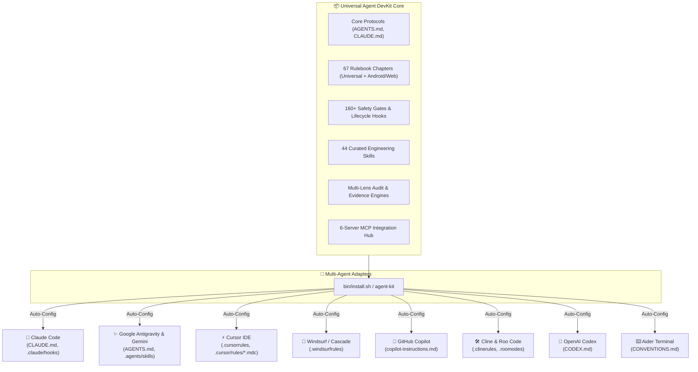

<div align="center">

# 🚀 Universal AI Agent DevKit & Quality Protocol
### *A unified, production-grade framework providing Zero-Defect protocols, automated safety gates, 44 curated canonical skills, and MCP tools across Claude Code, Google Gemini/Antigravity, Cursor, Windsurf, Copilot, and Codex.*

[](https://github.com/ToanMobile/universal-agent-devkit)
[](https://opensource.org/licenses/MIT)
[-success.svg?style=for-the-badge)](./hooks/tests)
[](#-universal-multi-agent-matrix)
[](#-complete-rulebook--engineering-standards-catalog)
[](#-45-curated-engineering-skills-catalog)
[](#-mcp-model-context-protocol-hub)

<p align="center">
  🌐 <b>Languages:</b> <a href="README.md"><b>English 🇺🇸</b></a> • <a href="README.vi.md"><b>Tiếng Việt 🇻🇳</b></a>
</p>

<p align="center">
  <b>One DevKit to rule them all:</b> Elevate your AI coding assistants from conversational LLMs into rigorous, disciplined, and evidence-backed <b>Principal Pair Programmers</b>.
</p>

[Quick Start](#-quick-start--installation) • [Architecture](#-system-architecture) • [Multi-Agent Matrix](#-universal-multi-agent-matrix) • [Rulebook Catalog](#-complete-rulebook--engineering-standards-catalog) • [Skills Catalog](#-45-curated-engineering-skills-catalog) • [MCP Hub](#-mcp-model-context-protocol-hub) • [Verification](#-verification--test-evidence)

---

</div>

## 📖 Executive Summary

**Universal Agent DevKit** is an enterprise-grade engineering framework designed for all major AI Coding Agents (**Claude Code**, **Google Antigravity & Gemini CLI**, **Cursor IDE**, **Windsurf**, **GitHub Copilot**, **Cline & Roo Code**, **OpenAI Codex**, **Aider**) and foundation models (**Claude 3.5/3.7 Sonnet**, **GPT-4o / o1 / o3**, **Gemini 2.0/3.0**, **DeepSeek R1/V3**, **Llama 3**).

It delivers a complete, closed-loop software engineering ecosystem:
1. **Supreme Engineering Protocols:** Zero-Defect Protocol, Paired Executable Oracle (RED→GREEN), and No-Fabrication Engine.
2. **67 Rulebook Chapters:** 17 universal core rules + 50 domain-specialized chapters (Android/Compose, Web, Backend).
3. **Machine Safety Gates:** 9 lifecycle safety hooks backed by 160+ unit contract tests that prevent hallucinated edits and catch bugs before commit.
4. **44 Curated Engineering Skills:** Grouped into 5 specialized functional suites covering testing, architecture, office document parsing, meta-tooling, and UI.
5. **Universal MCP Hub:** Pre-configured with 6 Model Context Protocol servers for AST Knowledge Graph discovery, real-time documentation lookup, Android ADB control, and Play Store automation.

---

## 🌟 6 Core Quality Pillars

```
┌────────────────────────────────────────────────────────────────────────────────────────┐
│                        UNIVERSAL AGENT QUALITY PROTOCOL                                │
├────────────────────────────┬────────────────────────────┬──────────────────────────────┤
│ 🛡️ Zero-Defect Protocol    │ 🚫 No-Fabrication Engine   │ 🔒 160+ Machine Safety Gates │
│ Paired Executable Oracle   │ C1–C9 Decision Table       │ Lifecycle Hooks              │
│ (Mandatory RED → GREEN)    │ Zero hallucinated metrics  │ Pre-Code & Stop Gates        │
├────────────────────────────┼────────────────────────────┼──────────────────────────────┤
│ ⚡ 7-Lens Multi-Audit      │ 📜 67 Rulebook Chapters    │ 🧰 44 Curated Skills         │
│ Compile, Runtime, State,   │ Universal + 50 Android     │ 5 functional suites: QA,     │
│ UX, Security, Architecture │ Domain Specialized Rules   │ TDD, Spec, Office, DevTools  │
└────────────────────────────┴────────────────────────────┴──────────────────────────────┘
```

<details>
<summary><b>🔍 Expand details for all 6 quality pillars (Click to open)</b></summary>

### 1. 🛡️ Zero-Defect Protocol & Paired Executable Oracle
- **Inviolable Rule:** Before modifying any production code, the AI agent **MUST execute a failing test oracle** at the real failure boundary and observe the failing state (**RED**). After editing, it must re-execute the exact same oracle to observe the passing state (**GREEN**).
- **Protection of Working Code:** Existing code is protected by default. Modifications require discriminating evidence of error or explicit user authority.

### 2. 🚫 No-Fabrication Engine (C1–C9 Decision Table)
- **Eliminating Hallucinations:** Strict prohibition against guessing file paths, symbol signatures, library versions, benchmark metrics, or test outcomes.
- **Strict Evidence Standards:**
  - `C1`: Structural fact → Direct quote from fresh source or AST Knowledge Graph.
  - `C2`: Version / API contract → Measured or verified via Context7 official documentation.
  - `C3/C5`: Outcome / Fix works → Validated with discriminating runtime test evidence.
  - `C4`: Negative claim ("X is unaffected") → Full codebase search verification.

### 3. 🔒 160+ Automated Safety Gates (Lifecycle Hooks)
- `precode_gate.sh`: Blocks blind code edits if the file has not been read in the current session.
- `review_gate.sh`: Enforces multi-lens code reviews before completing tasks.
- `test_evidence_gate.sh`: Verifies actual XML test reports on disk (`tests > 0, failures = 0, errors = 0`).
- `block-dangerous-git.sh`: Blocks destructive Git actions (force pushes, hard resets, unstaged drops).
- `churn_guard.sh` & `comment_claim_guard.sh`: Blocks editing a single file > 3 times consecutively and scans comment claims.

### 4. ⚡ 7-Lens Multi-Audit Engine
Automated 7-dimension review system (`multi-lens-audit.js`):
1. 🔬 **Compile-time Lens:** Type-safety, nullability, deprecation, binary compatibility.
2. ⚡ **Runtime Lens:** Resource leaks, memory allocation, OOM risks, boundary exceptions.
3. 🔄 **State & Concurrency Lens:** Race conditions, thread safety, immutability.
4. 🧪 **Test Quality Lens:** Mutation coverage, boundary test cases, oracle precision.
5. 🎨 **UX & Accessibility Lens:** Visual hierarchy, accessibility standards, responsiveness.
6. 🔒 **Security & Privacy Lens:** Intent injection, permission boundaries, credential safety.
7. 📐 **Architecture Lens:** Seam isolation, clean DI, unidirectional data flow.

</details>

---

## 📐 System Architecture



---

## 📜 Complete Rulebook & Engineering Standards Catalog

The DevKit organizes rules into **17 Universal Core Rules** applicable to all projects and **50 Domain-Specific Rules**:

### 1. 🌐 Universal Core Rules (`core/rules/`)

| Rule Chapter | Domain / Topic | Core Principles & Purpose |
|---|---|---|
| [`01-testing.md`](file://core/rules/01-testing.md) | Testing & Quality Gate | Enforces Paired Executable Oracle (RED→GREEN), zero assertion waivers, physical XML test report verification. |
| [`02-general.md`](file://core/rules/02-general.md) | Senior Engineering Policy | Level-4 engineer autonomous standards, Graph-First protocol, English default with multilingual support. |
| [`03-architecture.md`](file://core/rules/03-architecture.md) | Clean Architecture | Strict layering (Presentation → Domain → Data), Unidirectional Data Flow, Dependency Inversion. |
| [`04-style-guide.md`](file://core/rules/04-style-guide.md) | Formatting & Style | Naming conventions, file structure, nullability, immutability, clean code guidelines. |
| [`05-anti-patterns.md`](file://core/rules/05-anti-patterns.md) | Anti-Patterns | Prohibited patterns (God classes, leaky abstractions, side-effects in getters, blocking Main thread). |
| [`07-dry.md`](file://core/rules/07-dry.md) | DRY & Code Reuse | Safe code reuse, single source of truth for business logic and utilities. |
| [`09-performance.md`](file://core/rules/09-performance.md) | Performance Optimization | Memory management, zero unnecessary heap allocations, frame budget control (16ms/60fps, 8ms/120fps). |
| [`11-analyzer.md`](file://core/rules/11-analyzer.md) | Static Analyzers | Linter enforcement via ktlint, Detekt, Dependency Guard, Metalava API checks. |
| [`12-refactoring.md`](file://core/rules/12-refactoring.md) | Surgical Refactoring | Surgical Edits protocol, prohibits drive-by refactoring or formatting sweeps outside task scope. |
| [`13-systematic-debugging.md`](file://core/rules/13-systematic-debugging.md) | Systematic Debugging | 4-step root cause analysis: Reproduce → Isolate → Discriminating Test → Minimal Surgical Fix. |
| [`14-task-completion.md`](file://core/rules/14-task-completion.md) | Task Completion Gate | Defines terminal completion states, prohibits early stopping or asking user to type 'continue'. |
| [`15-ai-workflow.md`](file://core/rules/15-ai-workflow.md) | Subagent Orchestration | Subagent delegation, context compaction management, plan convergence workflows. |
| [`18-naming-conventions.md`](file://core/rules/18-naming-conventions.md) | Naming Conventions | Uniform naming rules for symbols, files, packages, test classes, and resource IDs. |
| [`19-security.md`](file://core/rules/19-security.md) | Security & Attack Surface | Security boundaries: Input validation, Intent injection, SAF path traversal, secret prevention. |
| [`22-git-conventions.md`](file://core/rules/22-git-conventions.md) | Git Conventions | Conventional Commits (`feat`, `fix`, `refactor`...), branch naming, safe merge protocols. |
| [`30-r8-proguard.md`](file://core/rules/30-r8-proguard.md) | Shrinking & ProGuard | Model serialization rules, mapping retention, release verification with R8 minification. |
| [`45-tdd-enforcement.md`](file://core/rules/45-tdd-enforcement.md) | TDD Gate Enforcement | Strictly requires writing failing tests (RED) before touching production code. |

<details>
<summary><b>📱 View 50 Specialized Android Rulebook Chapters (`domains/android/rulebook/`)</b></summary>

Comprehensive coverage for modern Android development:
- **UI & Compose:** `04-compose.md`, `06-compose-advanced.md`, `08-compose-performance.md`, `26-animations.md`, `27-accessibility.md`, `32-edge-to-edge.md`, `38-adaptive-layouts.md`, `41-custom-views.md`, `44-internationalization.md`.
- **Architecture & State:** `03-architecture.md`, `16-viewmodel.md`, `24-process-death.md`, `31-workmanager.md`, `34-state-restoration.md`, `39-offline-first.md`, `40-modularization.md`, `48-dependency-injection.md`.
- **Data & Storage:** `17-room.md`, `20-datastore.md`, `21-paging3.md`, `35-storage-access-framework.md`, `36-file-io.md`.
- **Concurrency & Networking:** `05-coroutines.md`, `07-flow.md`, `10-networking.md`, `28-caching.md`.
- **Quality, Perf & Benchmarks:** `01-testing.md`, `09-performance.md`, `11-analyzer-enforcement.md`, `23-memory-leaks.md`, `25-startup-optimization.md`, `29-battery-optimization.md`, `30-r8-proguard.md`, `33-baseline-profiles.md`, `37-microbenchmarks.md`, `42-ndk-jni.md`, `43-crash-reporting.md`, `45-tdd-enforcement.md`, `46-camera-media.md`, `47-deep-links.md`, `49-app-size.md`, `50-gradle-build-speed.md`.

</details>

---

## 🧰 44 Curated Engineering Skills Catalog

Standardized under the `SKILL.md` format (YAML frontmatter + Progressive Disclosure) across **5 functional groups**:

### 1. 🧪 Testing & Zero-Defect QA (6 Skills)
| Skill | Slash Command | Description & Purpose |
|---|---|---|
| **`qc`** | `/qc`, `/test`, `/qa` | Automated quality control: unit tests, lint checks (ktlint), Metalava API checks, and release QA gates. |
| **`fixbugs`** | `/fixbugs`, `/fix`, `/bugs` | Systematic bug diagnostic and repair workflow enforcing **Paired Executable Oracle (RED → GREEN)**. |
| **`tdd-workflow`** | `/tdd` | Test-Driven Development workflow: write failing unit tests before implementing production code. |
| **`verification-before-completion`** | `/verify` | Final verification gate before declaring task completion or opening pull requests. |
| **`triage-crashlytics-bug`** | `/crashlytics` | Triage Crashlytics stack traces, native crashes, OOM leaks, and memory regressions. |
| **`deploy`** | `/deploy`, `/build` | Artifact building (APK/AAB), signing verification, ProGuard/R8 mapping checks, and release gates. |

---

### 2. 📐 Architecture, Planning & Operations (11 Skills)
| Skill | Slash Command | Description & Purpose |
|---|---|---|
| **`spec-driven-development`** | `/plan` | Spec-Kit Lite planning for all changes touching ≥3 files or ≥2 modules. |
| **`deep-module-design`** | `/deep-design` | Evaluates seams, interface contracts, testability, and module abstractions. |
| **`grill-plan`** | `/grill` | Adversarial plan review: stress-test edge cases and architecture decisions before coding. |
| **`incremental-implementation`** | `/incremental` | Breaks down and implements large features step-by-step with verified TDD iterations. |
| **`session-handoff`** | `/handoff` | Packages active session context, uncommitted changes, and test proofs for seamless handoff. |
| **`merge-conflict-resolver`** | `/conflict` | Resolves complex Git merge, rebase, and stash conflicts with semantic 3-way analysis. |
| **`deprecation-migration`** | `/migration` | Sunset deprecated APIs and migrate dependencies safely without breaking consumers. |
| **`documentation-and-adrs`** | `/adr` | Records Architecture Decision Records (ADRs) capturing long-term architectural trade-offs. |
| **`graph-navigation`** | `/graph` | Codebase discovery, call-path tracing, and blast radius analysis via AST Knowledge Graph. |
| **`security-checklist`** | `/scan` | Security audit: Intent filters, URI traversal, Storage Access Framework, exported components, permissions. |
| **`observability-instrumentation`** | `/observability` | Audits and adds telemetry, structured logging, Firebase Analytics, Crashlytics & Perf metrics. |

---

### 3. 📄 Document & Data Processing Engines (4 Skills)
| Skill | Slash Command | Description & Purpose |
|---|---|---|
| **`documents`** | `/documents`, `/docx` | High-fidelity Microsoft Word (`.docx`) and Google Docs generation, redlining, and rendering. |
| **`spreadsheets`** | `/spreadsheets`, `/xlsx` | High-precision Microsoft Excel (`.xlsx`) formula evaluation, financial modeling, and charts. |
| **`presentations`** | `/presentations`, `/pptx` | Microsoft PowerPoint (`.pptx`) slide deck generation, layout orchestration, and presentation design. |
| **`pdf`** | `/pdf` | PDF reader, text/table extractor, OCR processor, merge/split tool, and form filler. |

---

### 4. 🛠️ Agent, Plugin & MCP Development (17 Skills)
| Skill | Slash Command | Description & Purpose |
|---|---|---|
| **`plugin-creator`** | `/plugin-creator` | Scaffolds and creates new plugin directories for Claude Code and Antigravity. |
| **`plugin-structure`** | `/plugin-structure` | Plugin layout architecture, manifest `plugin.json` configuration, and component discovery. |
| **`plugin-settings`** | `/plugin-settings` | Manages per-project plugin configurations via YAML frontmatter `.local.md` files. |
| **`skill-creator`** | `/skill-creator` | Creates new skills from scratch, benchmarks trigger accuracy, and runs evaluation loops. |
| **`skill-development`** | `/skill-development` | Progressive disclosure architecture for writing robust SKILL.md documentation. |
| **`skill-installer`** | `/skill-installer` | Discovers and installs curated skills directly from GitHub or package registries. |
| **`command-development`** | `/command-development` | Designs slash commands and establishes routing aliases for coding agents. |
| **`hook-development`** | `/hook-development` | Builds lifecycle safety hooks (PreToolUse, PostToolUse, Stop, SessionStart). |
| **`agent-development`** | `/agent-development` | Designs specialized subagents, tool permissions, and custom system prompts. |
| **`build-mcp-server`** | `/build-mcp-server` | Builds and packages custom Model Context Protocol servers (stdio, SSE, HTTP). |
| **`build-mcp-app`** | `/build-mcp-app` | Builds interactive UI widgets and form controls embedded directly in chat via MCP. |
| **`build-mcpb`** | `/build-mcpb` | Bundles and distributes standalone local MCP server packages (.mcpb). |
| **`mcp-integration`** | `/mcp-integration` | Configures `.mcp.json` and connects coding agents to external MCP services. |
| **`review-agent`** | `/review-agent` | Performs defect-first independent code reviews before commits or pull requests. |
| **`codebase-memory`** | `/codebase-memory` | Manages and synchronizes AST Knowledge Graph databases for large codebases. |
| **`writing-rules`** | `/writing-rules` | Authoring and standardizing rulebook chapters and hookify safety policies. |
| **`skills-author`** | `/skills-author` | Standards for authoring, auditing, and maintaining skills in the DevKit. |
| **`schedule`** | `/schedule` | Manages background recurring cron jobs and one-shot timer reminders for agents. |

---

### 5. 🎨 Frontend, Visualization & Platform Tools (6 Skills)
| Skill | Slash Command | Description & Purpose |
|---|---|---|
| **`frontend-design`** | `/frontend-design` | Modern UI aesthetics, typography, color palettes, and component design principles. |
| **`visualize`** | `/visualize` | Generates rich interactive HTML/SVG widgets, flowcharts, and data visualizations. |
| **`playground`** | `/playground` | Creates single-file interactive HTML playgrounds with visual control panels. |
| **`imagegen`** | `/imagegen` | Generates UI mockup wireframes, raster assets, and diagrams using AI image generation. |
| **`control-in-app-browser`** | `/control-in-app-browser` | Controls headless browser to inspect DOM, click, type, and capture visual state screenshots. |
| **`android-cli`** | `/android-cli` | Manages Android SDK components, controls emulators/AVDs, and captures UI hierarchy from CLI. |

---

## 🌐 Universal Multi-Agent Matrix

The DevKit automatically generates native configuration formats for all 8 major AI coding ecosystems:

| Platform / IDE | Generated Configuration Files | Activated Capabilities | Status |
|---|---|---|:---:|
| **Claude Code** | `CLAUDE.md`, `.claude/settings.json`, `.claude/commands/`, `.claude/hooks/`, `.mcp.json` | Slash Commands (`/qc`, `/fix`, `/plan`), automated runtime hooks, subagents, MCP tools | `READY` 🟢 |
| **Antigravity / Gemini** | `AGENTS.md`, `GEMINI.md`, `.agents/skills/`, `.agents/rules/`, `mcp_config.json` | Auto-discovery skills, contextual rulebook hierarchy, MCP integration | `READY` 🟢 |
| **Cursor IDE** | `.cursorrules`, `.cursor/rules/*.mdc` | Modular Rules format (`.mdc`), `alwaysApply` for Core Protocol | `READY` 🟢 |
| **Windsurf / Cascade** | `.windsurfrules`, `.windsurf/rules/` | Cascade System Rules, Zero-Defect & Pre-Code Gate enforcement | `READY` 🟢 |
| **GitHub Copilot** | `.github/copilot-instructions.md` | Workspace custom instructions for VS Code & JetBrains Copilot | `READY` 🟢 |
| **Cline & Roo Code** | `.clinerules`, `.roomodes` | Custom specialized subagent roles (*Principal Architect*, *Code Reviewer*, *SETI*) | `READY` 🟢 |
| **OpenAI Codex** | `CODEX.md` | Zero-Defect & Pre-Code Gate instructions for GPT models | `READY` 🟢 |
| **Aider** | `CONVENTIONS.md`, `.aider.conf.yml` | Auto test-command bindings, git diff verification, coding standards | `READY` 🟢 |

---

## 🔌 MCP (Model Context Protocol) Hub

The Model Context Protocol ecosystem is pre-configured in `mcp/` with over 100+ JSON tool schemas:

```
universal-agent-devkit/mcp/
├── .mcp.json               # Standard config for Claude Code & Cursor
├── mcp_config.json         # Standard config for Antigravity & Gemini
├── README.md               # Environment variables and setup instructions
└── schemas/                # 100+ Tool Definitions & Schemas
    ├── codebase-memory-mcp/
    ├── context7/
    ├── android-code-search/
    ├── android-skills/
    ├── replicant-mcp/
    └── play-store/
```

| Server Name | Transport | Key Capabilities & Tools |
|---|---|---|
| **`codebase-memory-mcp`** | stdio | AST Knowledge Graph, symbol search, call-path tracing (`search_graph`, `trace_path`, `get_code_snippet`). |
| **`context7`** | npx | Real-time official documentation lookup by library version (`resolve-library-id`, `query-docs`). |
| **`android-code-search`** | npx | AOSP source code and symbol search across Android releases (`search_android_code`). |
| **`android-skills`** | npx | Official Android engineering patterns and best practices (`list_skills`, `get_skill`). |
| **`replicant-mcp`** | npx | ADB device automation, screen capture, UI node inspection, UI tap/swipe, logcat, and Gradle runs. |
| **`play-store`** | Python stdio | Google Play APK/AAB deployment, crash vitals, ANR tracking, review replies. |

---

## 🚀 Quick Start & Installation

### Option 1: Remote One-Liner (Zero-Clone)

```bash
# Interactive Mode (Recommended — prompts for which agents to configure):
/bin/bash -c "$(curl -fsSL https://raw.githubusercontent.com/ToanMobile/universal-agent-devkit/main/bin/quick-install.sh)"

# Quick non-interactive setup (Configures all agents automatically):
curl -fsSL https://raw.githubusercontent.com/ToanMobile/universal-agent-devkit/main/bin/quick-install.sh | bash
```

---

### Option 2: Clone & Global CLI Setup (Recommended)
```bash
# 1. Clone the repository
git clone https://github.com/ToanMobile/universal-agent-devkit.git
cd universal-agent-devkit

# 2. Install agent-kit globally to ~/.local/bin
make install

# 3. Initialize DevKit instantly inside ANY project on your machine
cd /path/to/your-project
agent-kit init
```

#### Language Option:
- **Default (English):** `agent-kit init`
- **Vietnamese Option:** `agent-kit init --lang=vi`

---

### Option 3: Claude Code Plugin
```bash
claude plugin install github.com/ToanMobile/universal-agent-devkit
# or from local path:
claude plugin install /path/to/universal-agent-devkit
```

---

## 🧪 Verification & DevKit CLI (`agent-kit`)

Universal Agent DevKit includes a dedicated management and testing CLI:

```bash
# 1. Initialize current project (auto-detects domain & agents):
agent-kit init

# 2. Run full 294+ regression test suite:
agent-kit test

# 3. List all available skills:
agent-kit list

# 4. List all available slash commands:
agent-kit commands

# 5. Resynchronize skills and slash commands:
agent-kit sync
```

### 📊 Verified Test Evidence:
- **Hook Contract Tests:** `160 / 160 PASS (100%)` ✅
- **Workflow Engine Tests:** `134 / 134 PASS (100%)` ✅
- **Multi-Agent Sandbox Matrix:** `8 / 8 Ecosystems Verified` ✅

---

## 📁 Repository Layout

```
universal-agent-devkit/
├── .claude-plugin/              # Claude Code Plugin Manifest (plugin.json)
├── bin/                         # CLI entrypoints (install.sh, agent-kit, quick-install.sh)
├── core/                        # Universal SSOT (AGENTS.md, CLAUDE.md, rules, knowledge)
│   ├── rules/                   # 17 Universal Rule Chapters (Testing, Architecture, DRY, Security...)
│   └── knowledge/               # Universal Runbooks & Gate Layers
├── domains/                     # Domain-Specific Rulebooks
│   └── android/rulebook/        # 50 chapters Android/Compose/Room/Kotlin rulebook
├── skills/                      # 44 Curated Engineering Skills (SKILL.md standard)
├── commands/                    # Auto-discovered Slash Commands & Aliases (68 commands)
├── agents/                      # Specialized Subagents (.md)
├── hooks/                       # 9+ Lifecycle Safety Gates & 160+ Contract Tests
├── workflows/                   # Audit & Test Engines (134+ JS/MJS Tests)
├── mcp/                         # MCP Hub (.mcp.json, mcp_config.json, schemas)
├── setup.sh                     # Root setup entrypoint
├── Makefile                     # Build & Global install automation
└── adapters/                    # Setup scripts for 8 Agent & IDE platforms
```

---

## 📄 License & Repository

- **GitHub:** [https://github.com/ToanMobile/universal-agent-devkit](https://github.com/ToanMobile/universal-agent-devkit)
- **License:** Distributed under the **MIT License**.

<div align="center">
  <sub>Built with precision by Senior AI Software Engineers. Powered by Universal Agent Architecture.</sub>
</div>
