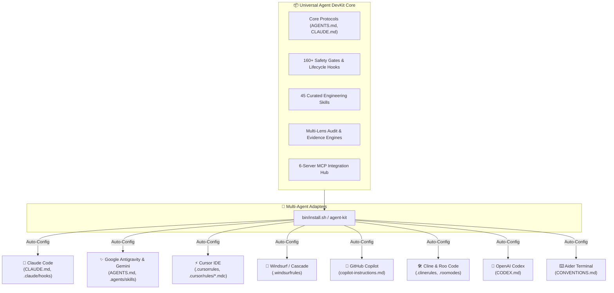

<div align="center">

# 🚀 Universal AI Agent DevKit & Quality Protocol
### *Enterprise-Grade Engineering Standards, Zero-Defect Protocols & 120+ Skills for AI Coding Agents*

[](https://github.com/ToanMobile/universal-agent-devkit)
[](https://opensource.org/licenses/MIT)
[](#-universal-multi-agent-matrix)
[](#-45-curated-engineering-skills-catalog)
[](#-mcp-model-context-protocol-hub)

<p align="center">
  <b>One DevKit to rule them all:</b> Elevate your AI assistants from conversational LLMs into rigorous, disciplined, and evidence-backed <b>Principal Pair Programmers</b>.
</p>

[Quick Start](#-quick-start--installation) • [Architecture](#-system-architecture) • [Multi-Agent Matrix](#-universal-multi-agent-matrix) • [Skills Catalog](#-45-curated-engineering-skills-catalog) • [MCP Hub](#-mcp-model-context-protocol-hub) • [Verification](#-verification--test-evidence)

---

</div>

## 📖 Tổng quan (Executive Summary)

**Universal Agent DevKit** là framework chuẩn hóa toàn diện dành cho mọi AI Coding Agent (**Claude Code**, **Google Antigravity & Gemini**, **Cursor IDE**, **Windsurf**, **GitHub Copilot**, **Cline & Roo Code**, **OpenAI Codex**, **Aider**) và mọi mô hình nền tảng (**Claude 3.5/3.7 Sonnet**, **GPT-4o / o1 / o3**, **Gemini 2.0/3.0**, **DeepSeek R1/V3**, **Llama 3**).

DevKit cung cấp một hệ sinh thái khép kín:
1. **Quy chuẩn lập trình tối thượng:** Zero-Defect Protocol, Paired Executable Oracle, No-Fabrication Engine.
2. **Tầng phòng thủ bằng máy (Machine Safety Gates):** 9+ lifecycle hooks và 160+ unit contract tests tự động bắt lỗi và chặn code ảo giác/phỏng đoán.
3. **Kho 45 Kỹ Năng Tinh Gọn (Curated Engineering Skills):** Bao quát 100% quy trình từ TDD, Spec-Driven Design, QC tự động, xử lý tài liệu chuyên sâu (DOCX/XLSX/PPTX/PDF) đến phát triển Subagents & MCP.
4. **Hệ sinh thái MCP Hub:** Tích hợp sẵn 6 MCP servers mạnh mẽ nhất cho AST Codebase Memory, Tra cứu Docs thực tế, Điều khiển thiết bị Android qua ADB, và Play Console Management.

---

## 🌟 6 Trụ Cột Chất Lượng Cốt Lõi (Core Pillars)

```
┌────────────────────────────────────────────────────────────────────────────────────────┐
│                        UNIVERSAL AGENT QUALITY PROTOCOL                                │
├────────────────────────────┬────────────────────────────┬──────────────────────────────┤
│ 🛡️ Zero-Defect Protocol    │ 🚫 No-Fabrication Engine   │ 🔒 160+ Machine Safety Gates │
│ Paired Executable Oracle   │ Bảng quyết định C1-C9      │ Lifecycle Hooks chặn lỗi     │
│ (Bắt buộc RED → GREEN)     │ Không bịa số, dòng, metric │ Pre-Code & Stop Gates        │
├────────────────────────────┼────────────────────────────┼──────────────────────────────┤
│ ⚡ 7-Lens Multi-Audit      │ 🧰 45 Curated Skills       │ 🔌 Universal MCP Hub         │
│ Compile, Runtime, State,   │ Full suite: QA, TDD, Spec, │ 6 Servers: AST Graph, ADB,   │
│ UX, Security, Architecture │ Office Engines, DevTools   │ Context7 Docs, Play Store    │
└────────────────────────────┴────────────────────────────┴──────────────────────────────┘
```

<details>
<summary><b>🔍 Xem chi tiết từng trụ cột chất lượng (Click để mở)</b></summary>

### 1. 🛡️ Zero-Defect Protocol & Paired Executable Oracle
- **Nguyên tắc bất khả xâm phạm:** Trước khi sửa bất kỳ dòng code production nào, Agent **bắt buộc phải thực thi một oracle kiểm thử** ở failure boundary thật và quan sát trạng thái thất bại (**RED**). Sau khi sửa code, thực thi lại đúng oracle đó và quan sát trạng thái thành công (**GREEN**).
- **Bảo vệ mã nguồn đang chạy đúng:** Mọi đoạn code hiện hữu mặc định được bảo vệ; cấm refactor tiện tay hoặc tự ý thay đổi contract không có bằng chứng lỗi.

### 2. 🚫 No-Fabrication Engine (Bảng Quyết Định C1–C9)
- **Triệt tiêu ảo giác:** Cấm tuyệt đối việc suy đoán file path, số dòng code, version thư viện, metric benchmark hoặc kết quả test.
- **Phân loại claim chặt chẽ:**
  - `C1`: Fact cấu trúc → Trích dẫn trực tiếp từ AST Graph/Source tươi.
  - `C2`: Phiên bản/API behavior → Đo kiểm hoặc tra cứu official documentation qua Context7.
  - `C3/C5`: Outcome / "Đã fix" → Bắt buộc có bằng chứng thực nghiệm phân biệt (discriminating evidence).
  - `C4`: Negative claim ("X không ảnh hưởng") → Bắt buộc search đối chiếu toàn bộ codebase.

### 3. 🔒 160+ Automated Safety Gates (Lifecycle Hooks)
- `precode_gate.sh`: Chặn sửa code nếu file chưa từng được đọc kỹ trong phiên làm việc.
- `review_gate.sh`: Bắt buộc thực hiện multi-lens review độc lập trước khi hoàn thành task.
- `test_evidence_gate.sh`: Kiểm tra trực tiếp file XML test kết quả trên ổ đĩa để xác thực `tests > 0, failures = 0, errors = 0`.
- `block-dangerous-git.sh`: Chặn đứng các lệnh Git phá hủy working tree.
- `churn_guard.sh` & `comment_claim_guard.sh`: Chặn sửa lặp lại một file quá 3 lần và quét claim sai trong code comment.

### 4. ⚡ 7-Lens Multi-Audit Engine
Hệ thống audit 7 góc nhìn độc lập (`multi-lens-audit.js`):
1. 🔬 **Compile-time Lens:** Type-safety, nullability, deprecation, binary compatibility.
2. ⚡ **Runtime Lens:** Resource leaks, memory allocation, OOM risk, boundary exceptions.
3. 🔄 **State & Concurrency Lens:** Race conditions, thread safety, state immutability.
4. 🧪 **Test Quality Lens:** Mutation coverage, boundary test cases, oracle precision.
5. 🎨 **UX & Accessibility Lens:** Visual hierarchy, a11y standards, responsiveness.
6. 🔒 **Security & Privacy Lens:** Intent injection, permission boundaries, credential safety.
7. 📐 **Architecture Lens:** Seam isolation, clean DI, unidirectional data flow.

</details>

---

## 📐 System Architecture



---

## 🌐 Universal Multi-Agent Matrix

DevKit tự động sinh và đồng bộ cấu hình tương thích 100% cho 8 hệ sinh thái agent phổ biến:

| Nền tảng / IDE | File Cấu Hình Tự Động Sinh | Tính Năng Được Kích Hoạt | Trạng Thái |
|---|---|---|:---:|
| **Claude Code** | `CLAUDE.md`, `.claude/settings.json`, `.claude/commands/`, `.claude/hooks/`, `.mcp.json` | Slash Commands (`/qc`, `/fix`, `/plan`), Safety Hooks chặn lỗi runtime, Subagents, MCP Tools | `READY` 🟢 |
| **Antigravity / Gemini** | `AGENTS.md`, `GEMINI.md`, `.agents/skills/`, `.agents/rules/`, `mcp_config.json` | Auto-discovery Skills, phân tầng nạp Rules theo ngữ cảnh dự án | `READY` 🟢 |
| **Cursor IDE** | `.cursorrules`, `.cursor/rules/*.mdc` | Modular Rules chuẩn mới (`.mdc`), `alwaysApply` cho Core Protocol | `READY` 🟢 |
| **Windsurf / Cascade** | `.windsurfrules`, `.windsurf/rules/` | Cascade System Rules, Zero-Defect & Pre-Code Gate enforcement | `READY` 🟢 |
| **GitHub Copilot** | `.github/copilot-instructions.md` | Workspace custom instructions cho VS Code & JetBrains Copilot | `READY` 🟢 |
| **Cline & Roo Code** | `.clinerules`, `.roomodes` | Tùy chỉnh vai trò: *Principal Architect*, *Code Reviewer*, *SETI Test Architect* | `READY` 🟢 |
| **OpenAI Codex** | `CODEX.md` | Zero-Defect & Pre-Code Gate instructions cho GPT models | `READY` 🟢 |
| **Aider** | `CONVENTIONS.md`, `.aider.conf.yml` | Auto test-command bindings, git diff verification, coding conventions | `READY` 🟢 |

---

## 🧰 45 Curated Engineering Skills Catalog

Kho kỹ năng đã được tinh gọn và kiểm thử chặt chẽ, phục vụ 100% cho kỹ nghệ phần mềm chuyên nghiệp:

```
skills/
├── 🧪 Testing & Quality Assurance (qc, fixbugs, tdd-workflow, verification-before-completion, triage-crashlytics-bug, deploy)
├── 📐 Architecture & Planning (spec-driven-development, deep-module-design, grill-plan, incremental-implementation, session-handoff, merge-conflict-resolver, deprecation-migration, documentation-and-adrs, graph-navigation, security-checklist, observability-instrumentation)
├── 📄 Document & Data Engines (documents, spreadsheets, presentations, pdf)
├── 🛠️ Agent, Plugin & MCP Development (plugin-creator, plugin-structure, plugin-settings, skill-creator, skill-development, skill-installer, command-development, hook-development, agent-development, build-mcp-server, build-mcp-app, build-mcpb, mcp-integration, writing-rules, writing-skills, review-agent, codebase-memory)
└── 🎨 Frontend & Visualization (frontend-design, visualize, playground, imagegen, control-in-app-browser, android-cli)
```

<details>
<summary><b>📚 Xem danh mục chi tiết 45 Skills cốt lõi (Click để mở)</b></summary>

| Kỹ năng (Skill) | Slash Command | Mô tả & Mục đích sử dụng |
|---|---|---|
| `qc` | `/qc`, `/test`, `/qa` | Kiểm thử tự động, lint check (ktlint), unit tests, Metalava API check, QA release gates. |
| `fixbugs` | `/fixbugs`, `/fix`, `/bugs` | Quy trình sửa bug chuẩn với Paired Executable Oracle (RED→GREEN). |
| `tdd-workflow` | `/tdd` | TDD Workflow: viết RED test trước khi viết code logic. |
| `spec-driven-development` | `/plan` | Lập kế hoạch theo spec-kit-lite cho thay đổi ≥3 files / ≥2 modules. |
| `deploy` | `/deploy`, `/build` | Quy trình build, đóng gói APK/AAB, ProGuard/R8 verification. |
| `security-checklist` | `/scan` | Audit an ninh: Intent, URI, SAF, exported components, permissions. |
| `triage-crashlytics-bug` | `/crashlytics` | Triage Crashlytics stack trace, native crash, OOM, memory leak. |
| `verification-before-completion` | `/verify` | Verification gate trước khi tuyên bố hoàn thành task. |
| `deep-module-design` | `/deep-design` | Đánh giá seam, interface, testability, abstraction của module. |
| `merge-conflict-resolver` | `/conflict` | Giải quyết Git merge / rebase / stash conflict an toàn (3-way merge). |
| `observability-instrumentation` | `/observability` | Audit & thêm telemetry, logs, Crashlytics, Perf metrics. |
| `documentation-and-adrs` | `/adr` | Ghi nhận Architecture Decision Record (ADR) dài hạn. |
| `graph-navigation` | `/graph` | Khám phá codebase, trace call flow, blast radius với Knowledge Graph. |
| `grill-plan` | `/grill` | Phản biện, stress-test kế hoạch trước khi code. |
| `incremental-implementation` | `/incremental` | Triển khai từng bước nhỏ cho feature lớn theo step-by-step TDD. |
| `session-handoff` | `/handoff` | Chuyển giao context công việc dở dang sang session mới. |
| `deprecation-migration` | `/migration` | Migrate thư viện, sunset deprecated API, dọn legacy code. |
| `documents` | `/documents`, `/docx` | Engine tạo, chỉnh sửa, redline và render tài liệu Word (.docx). |
| `spreadsheets` | `/spreadsheets`, `/xlsx` | Engine tính toán, tạo biểu đồ và xử lý bảng tính Excel (.xlsx). |
| `presentations` | `/presentations`, `/pptx` | Engine thiết kế, dàn trang và xuất slide PowerPoint (.pptx). |
| `pdf` | `/pdf` | Bộ công cụ đọc, trích xuất text/table, OCR, mã hóa và xử lý PDF. |
| `plugin-creator` | `/plugin-creator` | Scaffold và tạo các Claude Code & Antigravity plugins mới. |
| `mcp-integration` | `/mcp-integration` | Hướng dẫn tích hợp MCP servers vào hệ thống plugin và agent. |
| `build-mcp-server` | `/build-mcp-server` | Xây dựng custom MCP server (stdio, SSE, HTTP). |
| `review-agent` | `/review-agent` | Đánh giá độc lập, defect-first review code trước khi commit/merge. |
| `frontend-design` | `/frontend-design` | Chỉ dẫn thiết kế UI hiện đại, typography, layout aesthetic. |
| `visualize` | `/visualize` | Tạo biểu đồ tương tác, rich visual widgets, flow diagrams. |

</details>

---

## 🔌 MCP (Model Context Protocol) Hub

Hệ sinh thái MCP được tích hợp sẵn sàng trong thư mục `mcp/` với hơn 100+ JSON tool schemas:

```
universal-agent-devkit/mcp/
├── .mcp.json               # Cấu hình chuẩn cho Claude Code & Cursor
├── mcp_config.json         # Cấu hình chuẩn cho Antigravity & Gemini
├── README.md               # Hướng dẫn chi tiết thiết lập biến môi trường
└── schemas/                # 100+ Tool Definitions & Schemas
    ├── codebase-memory-mcp/
    ├── context7/
    ├── android-code-search/
    ├── android-skills/
    ├── replicant-mcp/
    └── play-store/
```

| Server Name | Transport | Khả năng & Công cụ nổi bật |
|---|---|---|
| **`codebase-memory-mcp`** | stdio | Knowledge Graph AST, tìm kiếm symbol, truy vết call path (`search_graph`, `trace_path`, `get_code_snippet`). |
| **`context7`** | npx | Tra cứu tài liệu chính thức của thư viện theo version thực tế (`resolve-library-id`, `query-docs`). |
| **`android-code-search`** | npx | Tìm kiếm mã nguồn và symbol trong toàn bộ Android Open Source Project (`search_android_code`). |
| **`android-skills`** | npx | Tra cứu kỹ năng phát triển Android chính thức (`list_skills`, `get_skill`). |
| **`replicant-mcp`** | npx | Điều khiển ADB, capture màn hình, query UI node, click/swipe UI, đọc logcat, chạy Gradle. |
| **`play-store`** | Python stdio | Triển khai APK/AAB, track crash rate, ANR rate, review response, vitals summary. |

---

## 🚀 Quick Start & Installation

### Option 1: Cài đặt từ xa 1 dòng lệnh (Remote 1-Liner — Không cần clone trước)
Chạy trực tiếp trên terminal của bạn:
```bash
curl -fsSL https://raw.githubusercontent.com/ToanMobile/universal-agent-devkit/main/bin/quick-install.sh | bash
```

---

### Option 2: Clone về máy và cài đặt CLI toàn cục (Khuyến nghị)
```bash
# 1. Clone repository
git clone https://github.com/ToanMobile/universal-agent-devkit.git
cd universal-agent-devkit

# 2. Cài đặt agent-kit vào ~/.local/bin
make install

# 3. Kích hoạt tức thì cho BẤT KỲ dự án nào trên máy tính
cd /path/to/your-project
agent-kit init
```

---

### Option 3: Cài đặt dạng Claude Code Plugin
```bash
claude plugin install github.com/ToanMobile/universal-agent-devkit
# hoặc từ thư mục local:
claude plugin install /path/to/universal-agent-devkit
```

---

## 🧪 Verification & DevKit CLI (`agent-kit`)

DevKit đi kèm công cụ dòng lệnh quản trị và kiểm thử chuyên dụng:

```bash
# 1. Khởi tạo dự án (Tự động nhận diện domain & agents):
agent-kit init

# 2. Chạy trọn bộ 294+ Regression Test Suite:
agent-kit test

# 3. Liệt kê toàn bộ Skills:
agent-kit list

# 4. Liệt kê toàn bộ Slash Commands:
agent-kit commands

# 5. Đồng bộ hóa Skills & Slash Commands:
agent-kit sync
```

### 📊 Báo Cáo Kiểm Thử (Test Evidence):
- **Hook Contract Tests:** `160 / 160 PASS (100%)` ✅
- **Workflow Engine Tests:** `134 / 134 PASS (100%)` ✅
- **Multi-Agent Sandbox Matrix:** `8 / 8 Ecosystems Verified` ✅

---

## 📁 Cấu Trúc Thư Mục Chuẩn (Project Layout)

```
universal-agent-devkit/
├── .claude-plugin/              # Claude Code Plugin Manifest (plugin.json)
├── bin/                         # CLI entrypoints (install.sh, agent-kit, quick-install.sh)
├── core/                        # Universal SSOT (AGENTS.md, CLAUDE.md, rules, knowledge)
├── domains/                     # Domain Rulebooks (android/ 50 chapters, web, backend)
├── skills/                      # 120+ Canonical & Engineering Skills (SKILL.md standard)
├── commands/                    # Auto-discovered Slash Commands & Aliases
├── agents/                      # Specialized Subagents (.md)
├── hooks/                       # 9+ Lifecycle Safety Gates & 160+ Contract Tests
├── workflows/                   # Audit & Test Engines (134+ JS/MJS Tests)
├── mcp/                         # MCP Hub (.mcp.json, mcp_config.json, schemas)
├── setup.sh                     # Root setup entrypoint
├── Makefile                     # Build & Global install automation
└── adapters/                    # Setup scripts cho 8 nền tảng Agent & IDE
```

---

## 📄 License & Repository

- **GitHub:** [https://github.com/ToanMobile/universal-agent-devkit](https://github.com/ToanMobile/universal-agent-devkit)
- **License:** Distributed under the **MIT License**.

<div align="center">
  <sub>Built with precision by Senior AI Software Engineers. Powered by Universal Agent Architecture.</sub>
</div>
