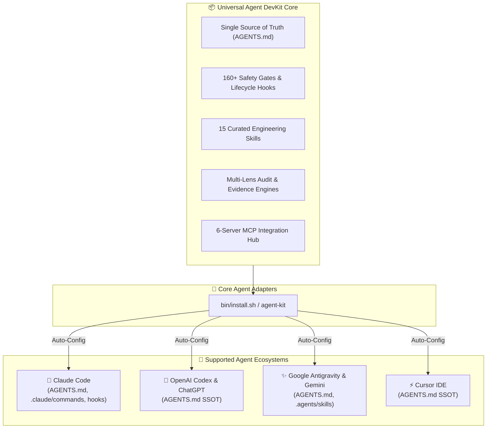

<div align="center">

# 🚀 Universal AI Agent DevKit & Quality Protocol
### *A unified, production-grade framework providing Zero-Defect protocols, automated safety gates, 15 curated canonical skills, and MCP tools across Claude Code, OpenAI Codex, Google Gemini/Antigravity, and Cursor.*

[](https://github.com/ToanMobile/universal-agent-devkit)
[](https://opensource.org/licenses/MIT)
[-success.svg?style=for-the-badge)](./hooks/tests)
[](#-universal-multi-agent-matrix)
[-red.svg?style=for-the-badge)](#-complete-rulebook--engineering-standards-single-source-of-truth)
[](#-15-curated-engineering-skills-catalog)
[](#-mcp-model-context-protocol-hub)

<p align="center">
  🌐 <b>Languages:</b> <a href="README.md"><b>English 🇺🇸</b></a> • <a href="README.vi.md"><b>Tiếng Việt 🇻🇳</b></a>
</p>

<p align="center">
  <b>One DevKit to rule them all:</b> Elevate your AI coding assistants from conversational LLMs into rigorous, disciplined, and evidence-backed <b>Principal Pair Programmers</b>.
</p>

[Quick Start](#-quick-start--installation) • [Architecture](#-system-architecture) • [Multi-Agent Matrix](#-universal-multi-agent-matrix) • [Rulebook Catalog](#-complete-rulebook--engineering-standards-single-source-of-truth) • [Skills Catalog](#-15-curated-engineering-skills-catalog) • [MCP Hub](#-mcp-model-context-protocol-hub) • [Verification](#-verification--test-evidence)

---

</div>

## 📖 Executive Summary

**Universal Agent DevKit** is an enterprise-grade engineering framework designed for the 4 core AI Coding Agents (**Claude Code**, **OpenAI Codex**, **Google Antigravity & Gemini CLI**, and **Cursor IDE**) and foundation models (**Claude 3.5/3.7 Sonnet**, **GPT-4o / o1 / o3**, **Gemini 2.0/3.0**, **DeepSeek R1/V3**).

It delivers a complete, closed-loop software engineering ecosystem:
1. **Supreme Engineering Protocols:** Zero-Defect Protocol, Paired Executable Oracle (RED→GREEN), and No-Fabrication Engine.
2. **Single Source of Truth Rulebook (AGENTS.md):** Eliminates rule sprawl and conflicting chapters by unifying all engineering standards, architecture rules, pre-code gates, and quality protocols into a single, authoritative master rule file (`AGENTS.md` / `Agent.md`).
3. **Machine Safety Gates:** 9 lifecycle safety hooks backed by 160+ unit contract tests that prevent hallucinated edits and catch bugs before commit.
4. **15 Curated Engineering Skills:** Grouped into 4 specialized functional suites covering testing, visual QA, architecture, and platform tools.
5. **Universal MCP Hub:** Pre-configured with 6 Model Context Protocol servers for AST Knowledge Graph discovery, real-time documentation lookup, Android ADB control, and Play Store automation.

---

## 🌟 6 Core Quality Pillars

```
┌────────────────────────────────────────────────────────────────────────────────────────┐
│                        UNIVERSAL AGENT QUALITY PROTOCOL                                │
├────────────────────────────┬────────────────────────────┬──────────────────────────────┤
│ 🛡️ Zero-Defect Protocol    │ 🚫 No-Fabrication Engine   │ 🔒 160+ Machine Safety Gates │
│ Paired Executable Oracle   │ C1–C9 Decision Table       │ Lifecycle Hooks              │
│ (Mandatory RED → GREEN)    │ Zero hallucinated metrics  │ Pre-Code & Stop Gates        │
├────────────────────────────┼────────────────────────────┼──────────────────────────────┤
│ ⚡ 7-Lens Multi-Audit      │ 📜 Unified Master Rules    │ 🧰 15 Curated Skills         │
│ Compile, Runtime, State,   │ AGENTS.md (Single SSOT)    │ 4 functional suites: QA,     │
│ UX, Security, Architecture │ 0 Fragmented Rule Files    │ TDD, Spec, Review, Platform  │
└────────────────────────────┴────────────────────────────┴──────────────────────────────┘
```

<details>
<summary><b>🔍 Expand details for all 6 quality pillars (Click to open)</b></summary>

### 1. 🛡️ Zero-Defect Protocol & Paired Executable Oracle
- **Inviolable Rule:** Before modifying any production code, the AI agent **MUST execute a failing test oracle** at the real failure boundary and observe the failing state (**RED**). After editing, it must re-execute the exact same oracle to observe the passing state (**GREEN**).
- **Protection of Working Code:** Existing code is protected by default. Modifications require discriminating evidence of error or explicit user authority.

### 2. 🚫 No-Fabrication Engine (C1–C9 Decision Table)
- **Eliminating Hallucinations:** Strict prohibition against guessing file paths, symbol signatures, library versions, benchmark metrics, or test outcomes.
- **Strict Evidence Classes:** Enforces explicit citations for structural source facts (C1), version measurements (C2), runtime fixes (C3), scope coverage (C4), and terminal completion claims (C5).

### 3. 🔒 160+ Automated Safety Gates (Lifecycle Hooks)
- **Real-Time Interception:** PreToolUse and Stop hooks intercept every write, shell execution, and subagent handoff.
- **Automated Rejection:** Automatically blocks destructive git commands (`git push --force`, `git reset --hard`), unvetted file edits, credential leakage, and unverifiable completion claims.

### 4. ⚡ 7-Lens Multi-Audit Engine
- **Full Spectrum Auditing:** Analyzes diffs across 7 lenses: Compile, Runtime, State Continuity, UX, Security, Performance, and Architecture.
- **Fail-Closed Receipts:** Requires deterministic cryptographically signed or content-hashed execution receipts before promoting any change to PASS.

</details>

---

## 🏛️ System Architecture



---

## 📜 Complete Rulebook & Engineering Standards (Single Source of Truth)

All engineering rules, multi-agent architecture contracts, and quality protocols are consolidated into a single authoritative source of truth: [`AGENTS.md`](file://AGENTS.md).

No fragmented rule files or conflicting directories exist. Key protocols enforced within `AGENTS.md`:
- **Architecture & Modularization:** Clean Architecture boundaries, Layer isolation (Presentation → Domain → Data), and clean DI.
- **Pre-Code Gate (Section 5):** 5-box mandatory check (Target + authority, real source read, consumer list, failure mechanism, residual) before modifying production code.
- **Zero-Defect Protocol & Paired Executable Oracle:** Mandatory RED → GREEN verification on physical failure boundary with zero waivers.
- **No-Fabrication Engine (C1–C9 Decision Table):** Strict prohibition against hallucinated metrics, file paths, or test results.
- **Solo Dev & Git Conventions:** Conventional Commits (`feat`, `fix`, `chore`), zero secret commits, surgical diffs, and clean PR workflows.
- **Multi-Agent Cross-Compatibility:** Synchronized to all 8 AI agent platforms with 100% fidelity.

---

## 🧰 15 Curated Engineering Skills Catalog

Standardized under the `SKILL.md` format (YAML frontmatter + Progressive Disclosure) across **4 functional suites**:

### 1. 🧪 Testing & Zero-Defect QA (6 Skills)
| Skill | Slash Command | Description & Purpose |
|---|---|---|
| **`qc`** | `/qc`, `/test`, `/qa` | Automated quality control: unit tests, lint checks (ktlint), Metalava API checks, and release QA gates. |
| **`fixbugs`** | `/fixbugs`, `/fix`, `/bugs` | Systematic bug diagnostic and repair workflow enforcing **Paired Executable Oracle (RED → GREEN)**. |
| **`tdd-workflow`** | `/tdd` | Test-Driven Development workflow: write failing unit tests before implementing production code. |
| **`verification-before-completion`** | `/verify` | Final verification gate before declaring task completion or opening pull requests. |
| **`triage-crashlytics-bug`** | `/crashlytics` | Triage Crashlytics stack traces, native crashes, OOM leaks, and memory regressions. |
| **`deploy`** | `/deploy`, `/build` | Artifact building (APK/AAB), signing verification, ProGuard/R8 mapping checks, and release gates. |

---

### 2. 🔍 Code Review & Visual QA (2 Skills)
| Skill | Slash Command | Description & Purpose |
|---|---|---|
| **`qa-review`** | `/qa-review`, `/review` | Deep code diff audit before PR, acceptance criteria generation, and test scenario matrix (Role × Data × Error). |
| **`qa-visual`** | `/qa-visual`, `/visual` | Automated screenshot capture and DOM layout auditing (overflow, alignment, overlaps) with cloud upload. |

---

### 3. 📐 Architecture, Git & Planning (4 Skills)
| Skill | Slash Command | Description & Purpose |
|---|---|---|
| **`spec-driven-development`** | `/plan` | Spec-Kit Lite planning for all changes touching ≥3 files or ≥2 modules. |
| **`merge-conflict-resolver`** | `/conflict` | Resolves complex Git merge, rebase, and stash conflicts with semantic 3-way analysis. |
| **`session-handoff`** | `/handoff` | Packages active session context, uncommitted changes, and test proofs for seamless handoff. |
| **`security-checklist`** | `/scan` | Security audit: Intent filters, URI traversal, Storage Access Framework, exported components, permissions. |

---

### 4. 🛠️ Codebase & Platform Tools (3 Skills)
| Skill | Slash Command | Description & Purpose |
|---|---|---|
| **`graph-navigation`** | `/graph` | Codebase discovery, call-path tracing, and blast radius analysis via AST Knowledge Graph. |
| **`codebase-memory`** | `/codebase-memory` | Manages and synchronizes AST Knowledge Graph databases for large codebases. |
| **`android-cli`** | `/android-cli` | Manages Android SDK components, controls emulators/AVDs, and captures UI hierarchy from CLI. |

---

## 🌐 Universal Multi-Agent Matrix

The DevKit natively synchronizes with the 4 core AI coding ecosystems using `AGENTS.md` as the universal single source of truth:

| Platform / IDE | Configuration & Integration | Activated Capabilities | Status |
|---|---|---|:---:|
| **Claude Code** | `AGENTS.md`, `.claude/settings.json`, `.claude/commands/`, `.claude/hooks/`, `.mcp.json` | Slash Commands (`/qc`, `/fix`, `/plan`), automated runtime safety hooks, subagents, MCP tools | `READY` 🟢 |
| **OpenAI Codex** | `AGENTS.md` (SSOT) | Universal Master Rules, Pre-Code Gate & Zero-Defect protocol for OpenAI GPT models & Canvas | `READY` 🟢 |
| **Antigravity / Gemini** | `AGENTS.md`, `.agents/skills/`, `mcp_config.json` | Auto-discovery skills, Zero-Defect QA protocols, MCP integration | `READY` 🟢 |
| **Cursor IDE** | `AGENTS.md` (SSOT) | Native repository rules, Zero-Defect QA & Pre-Code Gate enforcement | `READY` 🟢 |

---

## 🔌 MCP (Model Context Protocol) Hub

The Model Context Protocol ecosystem is pre-configured in `mcp/` with over 100+ JSON tool schemas:

```
universal-agent-devkit/mcp/
├── .mcp.json               # Standard config for Claude Code & Cursor
├── mcp_config.json         # Standard config for Antigravity & Gemini
├── README.md               # Environment variables and setup instructions
└── schemas/                # 100+ Tool Definitions & Schemas
    ├── codebase-memory-mcp/
    ├── context7/
    ├── android-code-search/
    ├── android-skills/
    ├── replicant-mcp/
    └── play-store/
```

| Server Name | Transport | Key Capabilities & Tools |
|---|---|---|
| **`codebase-memory-mcp`** | stdio | AST Knowledge Graph, symbol search, call-path tracing (`search_graph`, `trace_path`, `get_code_snippet`). |
| **`context7`** | npx | Real-time official documentation lookup by library version (`resolve-library-id`, `query-docs`). |
| **`android-code-search`** | npx | AOSP source code and symbol search across Android releases (`search_android_code`). |
| **`android-skills`** | npx | Official Android engineering patterns and best practices (`list_skills`, `get_skill`). |
| **`replicant-mcp`** | npx | ADB device automation, screen capture, UI node inspection, UI tap/swipe, logcat, and Gradle runs. |
| **`play-store`** | Python stdio | Google Play APK/AAB deployment, crash vitals, ANR tracking, review replies. |

---

## 🚀 Quick Start & Installation

### Option 1: Remote One-Liner (Zero-Clone)

```bash
# Interactive Mode (Recommended — prompts for which agents to configure):
/bin/bash -c "$(curl -fsSL https://raw.githubusercontent.com/ToanMobile/universal-agent-devkit/main/bin/quick-install.sh)"

# Quick non-interactive setup (Configures all agents automatically):
curl -fsSL https://raw.githubusercontent.com/ToanMobile/universal-agent-devkit/main/bin/quick-install.sh | bash
```

---

### Option 2: Clone & Global CLI Setup (Recommended)
```bash
# 1. Clone the repository
git clone https://github.com/ToanMobile/universal-agent-devkit.git
cd universal-agent-devkit

# 2. Install agent-kit globally to ~/.local/bin
make install

# 3. Initialize DevKit instantly inside ANY project on your machine
cd /path/to/your-project
agent-kit init
```

#### Language Option:
- **Default (English):** `agent-kit init`
- **Vietnamese Option:** `agent-kit init --lang=vi`

---

### Option 3: Claude Code Plugin
```bash
claude plugin install github.com/ToanMobile/universal-agent-devkit
# or from local path:
claude plugin install /path/to/universal-agent-devkit
```

---

## 🧪 Verification & DevKit CLI (`agent-kit`)

Universal Agent DevKit includes a dedicated management and testing CLI:

```bash
# 1. Initialize current project (auto-detects domain & agents):
agent-kit init

# 2. Run full 294+ regression test suite:
agent-kit test

# 3. List all available skills:
agent-kit list

# 4. List all available slash commands:
agent-kit commands

# 5. Resynchronize skills and slash commands:
agent-kit sync
```

### 📊 Verified Test Evidence:
- **Hook Contract Tests:** `160 / 160 PASS (100%)` ✅
- **Workflow Engine Tests:** `134 / 134 PASS (100%)` ✅
- **Multi-Agent Sandbox Matrix:** `4 / 4 Core Ecosystems Verified` ✅

---

## 📁 Repository Layout

```
universal-agent-devkit/
├── .claude-plugin/              # Claude Code Plugin Manifest (plugin.json)
├── bin/                         # CLI entrypoints (install.sh, agent-kit, quick-install.sh)
├── AGENTS.md                    # Universal Master Rules & SSOT (Sole Rule File)
├── skills/                      # 15 Curated Engineering Skills (SKILL.md standard)
├── commands/                    # Auto-discovered Slash Commands & Aliases (30 commands)
├── agents/                      # Specialized Subagents (.md)
├── hooks/                       # 9+ Lifecycle Safety Gates & 160+ Contract Tests
├── workflows/                   # Audit & Test Engines (134+ JS/MJS Tests)
├── mcp/                         # MCP Hub (.mcp.json, mcp_config.json, schemas)
├── setup.sh                     # Root setup entrypoint
├── Makefile                     # Build & Global install automation
└── adapters/                    # Setup scripts for 4 Core Agent & IDE platforms
```

---

## 📄 License & Repository

- **GitHub:** [https://github.com/ToanMobile/universal-agent-devkit](https://github.com/ToanMobile/universal-agent-devkit)
- **License:** Distributed under the **MIT License**.

<div align="center">
  <sub>Built with precision by Senior AI Software Engineers. Powered by Universal Agent Architecture.</sub>
</div>
