<div align="center">

# 🚀 Universal AI Agent DevKit & Quality Protocol
### *A unified, production-grade framework providing Zero-Defect protocols, automated safety gates, 16 curated canonical skills, dynamic domain profiles, 50 audit agents, and MCP tools across Claude Code, OpenAI Codex, Google Gemini/Antigravity, and Cursor.*

[](https://github.com/ToanMobile/universal-agent-devkit)
[](https://opensource.org/licenses/MIT)
[-success.svg?style=for-the-badge)](./hooks/tests)
[](#-universal-multi-agent-matrix)
[-red.svg?style=for-the-badge)](#-complete-rulebook--engineering-standards-single-source-of-truth)
[](#-16-curated-engineering-skills-catalog)
[](#-dynamic-domain-profiles-system)
[-yellow.svg?style=for-the-badge)](#-10-quality-audit-councils-50-specialized-agents)
[](#-mcp-model-context-protocol-hub)

<p align="center">
  🌐 <b>Languages:</b> <a href="README.md"><b>English 🇺🇸</b></a> • <a href="README.vi.md"><b>Tiếng Việt 🇻🇳</b></a>
</p>

<p align="center">
  <b>One DevKit to rule them all:</b> Elevate your AI coding assistants from conversational LLMs into rigorous, disciplined, and evidence-backed <b>Principal Pair Programmers</b>.
</p>

[Quick Start](#-quick-start--installation) • [Architecture](#-system-architecture) • [Workflows](#-production-engineering-workflows) • [Domain Profiles](#-dynamic-domain-profiles-system) • [Post-Fix Shield](#-post-fix-quality-shield--5-layer-audit-gate) • [50-Agent Councils](#-10-quality-audit-councils-50-specialized-agents) • [Multi-Agent Matrix](#-universal-multi-agent-matrix) • [Rulebook SSOT](#-complete-rulebook--engineering-standards-single-source-of-truth) • [Skills Catalog](#-16-curated-engineering-skills-catalog) • [MCP Hub](#-mcp-model-context-protocol-hub) • [Verification](#-verification--devkit-cli-agent-kit)

---

</div>

## 📖 Executive Summary

**Universal Agent DevKit** is an enterprise-grade engineering framework designed for the 4 core AI Coding Agents (**Claude Code**, **OpenAI Codex**, **Google Antigravity & Gemini CLI**, and **Cursor IDE**) and foundation models (**Claude 3.5/3.7 Sonnet**, **GPT-4o / o1 / o3**, **Gemini 2.0/3.0**, **DeepSeek R1/V3**).

It delivers a complete, closed-loop software engineering ecosystem:
1. **Supreme Engineering Protocols:** Zero-Defect Protocol, Paired Executable Oracle (RED→GREEN), and No-Fabrication Engine (C1–C9 Decision Table).
2. **Single Source of Truth Rulebook (`AGENTS.md`):** Eliminates rule sprawl and conflicting chapters by unifying all engineering standards, architecture rules, pre-code gates, and quality protocols into a single, authoritative master rule file (`AGENTS.md` / `Agent.md`).
3. **Dynamic Domain Profiles:** Instant project domain switching between **Automotive** (AAOS/CAN), **Android** (Compose/Vitals), **Game** (Unity/ECS), and **Universal** software engineering via `agent-kit profile`.
4. **Post-Fix Quality Shield (5-Layer Audit Gate):** Automated multi-tier verification (`/audit-gate`, `agent-kit gate`) executing structural diff checks, RED→GREEN oracle confirmation, 50-agent council review, TIA regression matrix validation, and non-destructive secret scanning.
5. **10 Quality Audit Councils (50 Specialized Agents):** Comprehensive governance engine scrutinizing Architecture, Security, Concurrency, Performance, Error Resilience, Memory Leaks, Test Integrity, Adversarial Chaos, Zero-Regression, and State Continuity.
6. **16 Curated Engineering Skills:** Standardized `SKILL.md` packages across 4 functional suites, including direct integration with **Alibaba OpenCodeReview v1.12.9 (`ocr`)** for deterministic AST diff review.
7. **Design System & Proactive Failure Memory:** Strict UI/UX token baselines (`DESIGN.md`, Touch Target $\ge 48\text{dp}$, WCAG AA) paired with persistent repository failure lessons (`.agents/instincts.md`).
8. **Universal MCP Hub:** Pre-configured with 6 Model Context Protocol servers for AST Knowledge Graph discovery, real-time documentation lookup, Android ADB control, and Play Store automation.

---

## 🌟 7 Core Quality Pillars

```
┌────────────────────────────────────────────────────────────────────────────────────────┐
│                        UNIVERSAL AGENT QUALITY PROTOCOL                                │
├────────────────────────────┬────────────────────────────┬──────────────────────────────┤
│ 🛡️ Zero-Defect Protocol    │ 🚫 No-Fabrication Engine   │ 🔒 160+ Machine Safety Gates │
│ Paired Executable Oracle   │ C1–C9 Decision Table       │ Lifecycle Hooks              │
│ (Mandatory RED → GREEN)    │ Zero hallucinated metrics  │ Pre-Code & Stop Gates        │
├────────────────────────────┼────────────────────────────┼──────────────────────────────┤
│ ⚡ Post-Fix Quality Shield │ 📱 Dynamic Domain Profiles │ 🏛️ 10 Audit Councils        │
│ 8-Layer Audit Gate         │ Automotive, Android,       │ 50 Specialized Agents        │
│ (/audit-gate / agent-kit)  │ Game, Universal            │ 100% Zero-Regression Audit   │
├────────────────────────────┴────────────────────────────┴──────────────────────────────┤
│ 🧰 16 Curated Skills (Incl. Alibaba OpenCodeReview) • 📜 AGENTS.md Single SSOT         │
└────────────────────────────────────────────────────────────────────────────────────────┘
```

<details>
<summary><b>🔍 Expand details for all 7 quality pillars (Click to open)</b></summary>

### 1. 🛡️ Zero-Defect Protocol & Paired Executable Oracle
- **Inviolable Rule:** Before modifying any production code, the AI agent **MUST execute a failing test oracle** at the real failure boundary and observe the failing state (**RED**). After editing, it must re-execute the exact same oracle to observe the passing state (**GREEN**).
- **Protection of Working Code:** Existing code is protected by default. Modifications require discriminating evidence of error or explicit user authority.

### 2. 🚫 No-Fabrication Engine (C1–C9 Decision Table)
- **Eliminating Hallucinations:** Strict prohibition against guessing file paths, symbol signatures, library versions, benchmark metrics, or test outcomes.
- **Strict Evidence Classes:** Enforces explicit citations for structural source facts (C1), version measurements (C2), runtime fixes (C3), scope coverage (C4), and terminal completion claims (C5).

### 3. 🔒 160+ Automated Safety Gates (Lifecycle Hooks)
- **Real-Time Interception:** PreToolUse and Stop hooks intercept every write, shell execution, and subagent handoff.
- **Automated Rejection:** Automatically blocks destructive git commands (`git push --force`, `git reset --hard`), unvetted file edits, credential leakage, and unverifiable completion claims.

### 4. ⚡ Post-Fix Quality Shield & 5-Layer Audit Gate
- **Layer 1: Structural & Diff Hygiene:** Enforces surgical hunks, verifies boundary constraints, and blocks lazy placeholder comments (`// ... existing code ...`).
- **Layer 2: Zero-Defect Paired Oracle Check:** Validates RED→GREEN test proof on the exact failure boundary before allowing sign-off.
- **Layer 3: 50-Agent Council Audit:** Executes multi-lens automated scrutiny across Security, Architecture, Performance, Chaos, and Regression prevention.
- **Layer 4: TIA Regression Matrix Validation:** Validates full test impact analysis checklist (`regression_matrix.json`) with deterministic verification stamps.
- **Layer 5: Non-Destructive Git & Credential Shield:** Audits secret exclusion (`.env`, keystores, tokens), verifies Solo Dev Rule 0 compliance, and checks conventional commit readiness.

### 5. 📱 Dynamic Domain Profiles
- **Zero Pollution:** Keeps root `AGENTS.md` clean and universal while loading domain-specific rules (AAOS CAN Bus, Compose Vitals, Game ECS) dynamically into `rules/` symlinks.

### 6. 🏛️ 10 Quality Audit Councils (50 Specialized Agents)
- **Multi-Lens Auditing:** Analyzes diffs and codebases across 10 rigorous councils with 50 specialized automated agents.
- **Fail-Closed Receipts:** Requires deterministic cryptographically signed or content-hashed execution receipts before promoting any change to PASS.

### 7. 🧰 16 Curated Canonical Skills
- **Complete Software Lifecycle:** TDD, Bug Fixing, Spec-Kit Lite Planning, Visual QA, Crashlytics Triage, Conflict Resolution, Knowledge Graph discovery, and Alibaba OpenCodeReview (`ocr`).

</details>

---

## 🏛️ System Architecture

```mermaid
graph TD
    subgraph DevKit_Core ["📦 Universal Agent DevKit Core"]
        Rulebook["Single Source of Truth (AGENTS.md)"]
        Profiles["📱 Dynamic Profiles<br/>(Automotive / Android / Game / Universal)"]
        PostFixGate["⚡ Post-Fix Quality Shield<br/>(5-Layer Audit Gate / post-fix-gate.py)"]
        AuditCouncils["🏛️ 10 Audit Councils<br/>(50 Specialized Governance Agents)"]
        Gates["🔒 160+ Safety Gates & Lifecycle Hooks"]
        SkillsCatalog["🧰 16 Curated Canonical Skills"]
        DesignMemory["🎨 DESIGN.md & Failure Memory (.agents/instincts.md)"]
        MCPHub["🔌 6-Server MCP Hub (100+ Schemas)"]
    end

    subgraph CLI_Interface ["⚙️ DevKit Management CLI"]
        AgentKit["bin/agent-kit CLI"]
        ConfigPy["bin/agent-config.py"]
        HealthPy["bin/agent-health.py (100/100 Health)"]
    end

    subgraph Coding_Agents ["🤖 Supported Core Agent Ecosystems"]
        Claude["🤖 Claude Code<br/>(AGENTS.md, .claude/commands, hooks, settings)"]
        Codex["🧠 OpenAI Codex & ChatGPT<br/>(AGENTS.md SSOT)"]
        Gemini["✨ Google Antigravity & Gemini<br/>(AGENTS.md, .agents/skills, mcp_config.json)"]
        Cursor["⚡ Cursor IDE<br/>(AGENTS.md SSOT, .mcp.json)"]
    end

    DevKit_Core --> AgentKit
    AgentKit --> ConfigPy
    AgentKit --> HealthPy
    AgentKit --> PostFixGate
    AgentKit -->|Auto-Config| Claude
    AgentKit -->|Auto-Config| Codex
    AgentKit -->|Auto-Config| Gemini
    AgentKit -->|Auto-Config| Cursor
```



---

## 🔄 Production Engineering Workflows

Universal Agent DevKit orchestrates two interconnected workflow tiers:
1. **Automated Workflow Engines (`workflows/`):** Sandboxed JavaScript execution engines providing multi-lens auditing, cryptographic diff binding, and paired test oracle proofs backed by 134 automated unit test cases.
2. **End-to-End Developer Workflows:** Production-grade loops that guide AI agents and human developers from initial spec planning to verified release.

```mermaid
flowchart LR
    subgraph Spec_Phase ["1. Specification & Design"]
        A["/plan<br/>Spec-Kit Lite"] --> B["DESIGN.md Tokens<br/>Touch Target ≥ 48dp"]
    end

    subgraph TDD_Phase ["2. TDD & Implementation"]
        B --> C["/tdd<br/>Author Failing Oracle (RED)"]
        C --> D["Surgical Code Edit<br/>Clean Architecture DI"]
        D --> E["Execute Oracle<br/>Passing State (GREEN)"]
    end

    subgraph Audit_Phase ["3. Automated Auditing & QA"]
        E --> F["workflows/multi-lens-audit.js<br/>11-Lens Comprehensive Audit"]
        F --> G["/ocr (OpenCodeReview)<br/>AST Line-Accurate Review"]
        G --> H["/visual (qa-visual)<br/>DOM Layout & Overflow Audit"]
    end

    subgraph Gate_Phase ["4. Quality Gate & Handover"]
        H --> I["agent-kit gate (/audit-gate)<br/>5-Layer Post-Fix Shield"]
        I --> J["/verify<br/>Pre-PR Acceptance Gate"]
        J --> K["/handoff or PR<br/>Session Continuity Snapshot"]
    end
```



### 1. ⚙️ Automated Workflow Engines (`workflows/`)

Backed by **134 automated unit test cases** (Node.js test runner), these engines enforce mathematical rigor on code changes:

#### A. Scoped 11-Lens v3 Audit Engine (`workflows/multi-lens-audit.js`)
An automated audit engine executing in a sandboxed runtime. Evaluates tasks across **11 specialized lenses** with inline SHA-256 artifacts, machine oracles, exact-patch coverage, and fail-closed verdicts:
* **The 11 Auditing Lenses:**
  1. `compile` — Syntax verification, symbol resolution, type soundness, and import integrity.
  2. `business_logic` — Domain invariants, state machine transitions, and boundary condition handling.
  3. `runtime` — Exception safety, crash handler integrity, lifecycle transitions, and coroutine dispatch.
  4. `state` — Continuity across process recreation, memory leaks, and configuration changes.
  5. `tests` — Paired test oracle authenticity, non-tautological assertions, and meaningful test boundaries.
  6. `performance` — Memory allocation overhead, frame budget pacing (60/120 FPS), and unnecessary disk I/O.
  7. `ux_a11y` — Touch target compliance ($\ge 48\times 48\text{dp}$), contrast ratio ($\ge 4.5:1$), and instant click debouncing.
  8. `security` — Secret leakage prevention, intent injection defense, and permission boundaries.
  9. `build_noncode` — Gradle dependencies, ProGuard/R8 rules, AndroidManifest declarations, and resource configs.
  10. `arch` — Clean Architecture compliance: layer isolation (Presentation → Domain → Data) and loose coupling.
  11. `integration` — Cross-module contracts, API serialization, and backward compatibility.
* **3-Phase Execution:**
  * **Phase 1: Validate** — Rejects malformed scopes, stale ledgers, missing diff bounds, or fabricated diff metrics before starting.
  * **Phase 2: Audit** — Concurrently executes 11 complementary lenses against task-owned files and diffs.
  * **Phase 3: Consolidate** — Validates coverage shapes, merges stable finding identities, and computes a non-lossy, fail-closed audit verdict.

#### B. Fix Evidence & Paired Oracle Driver (`workflows/fix-evidence-driver.mjs`)
* Enforces **cryptographic execution receipts**: Binds test runs to exact git commit hashes, patch byte lengths, and SHA-256 output hashes.
* Rejects fabricated or model-authored test outputs: Demands driver-attested exit codes and terminal capture windows.
* Prevents silent regressions: Guarantees that pre-edit RED evidence and post-edit GREEN evidence bind to the exact same finding key.

---

### 2. 🚀 Core Developer & Agent Workflows

#### 🔄 Workflow 1: Spec-Driven Feature Development (New Features)
Used when adding new features or making changes touching $\ge 3$ files or $\ge 2$ modules:
1. **Spec Planning (`/plan`):** Author a Spec-Kit Lite design document detailing acceptance criteria, user roles, data schemas, and error cases.
2. **Design Tokens & a11y Check (`DESIGN.md`):** Ensure color tokens, typography scales, and touch targets ($\ge 48\text{dp}$) are planned.
3. **TDD Oracle Authoring (`/tdd`):** Write failing unit/integration tests before writing production code (**RED** state confirmed).
4. **Surgical Implementation:** Implement minimal required production code following Clean Architecture principles.
5. **Oracle Re-Execution:** Run the exact same test to confirm the passing (**GREEN**) state.
6. **Visual & Layout Audit (`/visual`):** Capture screenshots and audit DOM layouts for overflow, alignment, or clipping issues.
7. **Code Review (`/ocr` & `/review`):** Run Alibaba OpenCodeReview for AST line-accurate feedback and generate test scenarios.
8. **Pre-PR Acceptance Gate (`/verify`):** Final sign-off before opening a pull request.

#### 🛠️ Workflow 2: Zero-Defect Bug Diagnostic & Repair (Bug Fixing)
Used for resolving crashes, UI defects, logic bugs, or regressions:
1. **Triage & Trace:** Inspect stack traces via `/crashlytics` or trace call graphs via `/graph` (AST Knowledge Graph).
2. **Author Failing Test Oracle (`/fixbugs`):** Formulate a deterministic test reproducing the exact defect on the failure boundary. Run to verify **RED** exit code.
3. **Surgical Root-Cause Fix:** Apply the minimal surgical change directly targeting the root cause. Avoid unneeded refactoring.
4. **Verify Passing Oracle:** Re-run the exact same oracle to verify **GREEN** exit code with identical execution parameters.
5. **Post-Fix Quality Shield (`agent-kit gate` / `/audit-gate`):** Run the 5-layer audit gate to ensure zero side-effects, valid TIA regression matrix (`regression_matrix.json`), and clean diff hygiene.

#### 🔀 Workflow 3: Semantic Git Merge & Conflict Resolution
Used when git merge, rebase, cherry-pick, or stash pop encounters conflicts:
1. **Trigger Conflict Resolver (`/conflict`):** Run 3-way semantic conflict analysis across `base`, `ours`, and `theirs`.
2. **Semantic Merge:** Preserve architectural intent and clean DI without blindly selecting one side.
3. **Regression Validation (`/qc`):** Immediately run unit tests and linter to confirm clean resolution before committing.

#### 📦 Workflow 4: Session Context Handoff & Continuity
Used when reaching token limits, context resets, or handing off to another agent session:
1. **Snapshot State (`/handoff`):** Package active task goals, uncommitted changes, open findings, test proofs, and next steps.
2. **Handoff Export:** Write state to `.agents/handoff.md`.
3. **Session Restore:** Next session immediately resumes from the snapshot with zero loss of context.

---

## 📱 Dynamic Domain Profiles System

Universal Agent DevKit features a dynamic domain configuration system that activates specialized rules and verification matrices without cluttering the root rulebook:

```
profiles/
├── android/        # Mobile App: Jetpack Compose, Coroutines, M3, Android Vitals
├── automotive/     # AAOS: CAN Bus, Vehicle HAL, CarPropertyManager, ASIL-B, HMI Safety
├── game/           # Game Dev: Unity/Unreal, ECS, Frame Budget (60/120 FPS), Draw calls
└── universal/      # Cross-platform: Clean Architecture, REST/gRPC, Core Standards
```

### Profile Switching CLI

```bash
# View active profile:
agent-kit profile

# Switch to Automotive profile (AAOS / CAN Bus / Vehicle HAL):
agent-kit profile automotive

# Switch to Android Mobile profile (Jetpack Compose / Vitals):
agent-kit profile android

# Switch to Game Development profile (Unity / ECS / Performance):
agent-kit profile game

# Switch to Universal profile (Standard Cross-platform Clean Architecture):
agent-kit profile universal
```

> **Slash Command:** You can also switch profiles inside chat via `/profile [name]`.

---

## ⚡ Post-Fix Quality Shield & 8-Layer Audit Gate

Every bug fix or code modification must pass through the automated **8-Layer Quality Gate** before code completion or pull request creation:

```
[Layer 1] Git Diff & Structural Hygiene ──► Surgical hunks, zero secrets, anti-laziness
[Layer 2] Design System & Accessibility  ──► DESIGN.md, Touch Target ≥ 48dp, Debounced buttons
[Layer 3] Zero-Defect Paired Oracle      ──► Verified failing RED → passing GREEN proof
[Layer 4] TIA Regression Matrix & Guards ──► Checklist [x] PASS & Immutable Guards preserved
[Layer 5] Performance & Resource Audit  ──► O(1) lookups, non-blocking UI thread, 0 memory leak
[Layer 6] Error Resilience & Crash Trap  ──► Anti-swallowing (0 empty catch), timeouts, circuit breaker
[Layer 7] Structured Logging & PII Mask ──► Structured logs, masked secrets/credentials/tokens
[Layer 8] Alibaba OpenCodeReview Gate   ──► AST line resolution (resolver.go), 0 regressions
```

### Running the Post-Fix Gate

```bash
# Via agent-kit CLI:
agent-kit gate

# Via standalone binary:
postfix-gate

# Via Python script:
python3 bin/post-fix-gate.py

# In-chat Slash Command:
/audit-gate
```

---

## 🏛️ 10 Quality Audit Councils (50 Specialized Agents)

The DevKit integrates 10 automated quality audit councils comprising 50 specialized agents that continuously govern workflows, rules, skills, and regression resistance:

| Council # | Audit Council Name | Specialized Agent Focus Areas |
|:---:|---|---|
| **1** | **Architecture & Boundaries** | Clean Architecture, dependency directions, layer isolation, interface segregation, single responsibility. |
| **2** | **Security & Zero-Leak** | Secret scanning, permission boundaries, intent traversal, credential sanitization, secure storage. |
| **3** | **Concurrency & Thread-Safety** | Race condition prevention, thread dispatching, coroutine scope safety, mutual exclusion, deadlock guards. |
| **4** | **Performance & Resource** | Memory footprint, frame pacing (60/120 FPS), battery drain, unneeded allocations, disk I/O offloading. |
| **5** | **Error Resilience & Recovery** | Fail-closed defaults, graceful degradation, circuit breaking, network retry policies, unhandled crash traps. |
| **6** | **Memory & Leak Hunter** | Lifecycle leaks, context retention, observer unregistration, bitmap recycling, static reference cleanup. |
| **7** | **Test Quality & Oracle** | RED→GREEN paired oracle authenticity, assertion strength, coverage integrity, non-tautological test checks. |
| **8** | **Adversarial Chaos Council** | Boundary conditions, corrupted payloads, unexpected nulls, rapid cancellation, out-of-order execution. |
| **9** | **Zero-Regression Council** | Historical bug recurrence prevention, regression matrix validation, backward compatibility preservation. |
| **10** | **State Continuity & Handoff** | Context preservation, session handoff readiness, documentation freshness, unambiguous workstream state. |

> **Diagnostic Verification:** Run `./bin/agent-health.py` or `agent-kit health` to audit all 50 agents and 12 diagnostic checks (current score: **100/100 HEALTHY**).

---

## 🎨 Design System & Failure Memory

### 1. Universal Design System (`DESIGN.md`)
AI Agents must adhere to strict UI/UX engineering standards prior to modifying any user interface code:
- **Semantic Color Tokens:** Defined light/dark palette (`color-primary`, `color-surface`, `color-success`, etc.).
- **Spacing & Typography Grid:** Strict $8\text{pt} / 4\text{px}$ spacing hierarchy.
- **Accessibility Baseline (a11y):**
  - **Touch Target Size:** Mandatory $\ge 48\times 48\text{dp}$ on mobile ($\ge 44\times 44\text{px}$ on web).
  - **Contrast Ratio:** WCAG AA compliance ($\ge 4.5:1$ normal text, $\ge 3:1$ large text).
  - **Instant Debounce:** Action buttons must debounce and disable on the first click to prevent double-execution.

### 2. Proactive Failure Memory & Active Instincts (`.agents/instincts.md`)
Prevents agents from repeating known past repository failures:
- `[INSTINCT-001]` **Anti-Laziness:** Rejects partial placeholder comments (`// ... existing code ...`).
- `[INSTINCT-002]` **Button Double-Click Shield:** Mandates `isLoading` / `isSubmitting` state disabling.
- `[INSTINCT-003]` **No Wheel Reinvention:** Requires searching existing utilities before creating duplicates.
- `[INSTINCT-004]` **Credential Shield:** Forbids hardcoded secrets and requires masking in evidence.
- `[INSTINCT-005]` **Touch Target Enforcement:** Mandates minimum $48\text{dp}$ tap targets and $8\text{dp}$ button spacing.

---

## 📜 Complete Rulebook & Engineering Standards (Single Source of Truth)

All engineering rules, multi-agent architecture contracts, and quality protocols are consolidated into a single authoritative source of truth: [`AGENTS.md`](file://AGENTS.md).

No fragmented rule files or conflicting directories exist. Key protocols enforced within `AGENTS.md`:
- **Architecture & Modularization:** Clean Architecture boundaries, Layer isolation (Presentation → Domain → Data), and clean DI.
- **Pre-Code Gate (Section 5):** 5-box mandatory check (Target + authority, real source read, consumer list, failure mechanism, residual) before modifying production code.
- **Zero-Defect Protocol & Paired Executable Oracle:** Mandatory RED → GREEN verification on physical failure boundary with zero waivers.
- **No-Fabrication Engine (C1–C9 Decision Table):** Strict prohibition against hallucinated metrics, file paths, or test results.
- **Solo Dev & Git Conventions:** Conventional Commits (`feat`, `fix`, `chore`), zero secret commits, surgical diffs, and clean PR workflows (Rule 0: No commits or pushes without explicit user instruction).
- **Multi-Agent Cross-Compatibility:** Synchronized to all 4 AI agent platforms with 100% fidelity.

---

## 🧰 16 Curated Engineering Skills Catalog

Standardized under the `SKILL.md` format (YAML frontmatter + Progressive Disclosure) across **4 functional suites**:

### 1. 🧪 Testing & Zero-Defect QA (6 Skills)
| Skill | Slash Command | Description & Purpose |
|---|---|---|
| **`qc`** | `/qc`, `/test`, `/qa` | Automated quality control: unit tests, lint checks (ktlint), Metalava API checks, and release QA gates. |
| **`fixbugs`** | `/fixbugs`, `/fix`, `/bugs` | Systematic bug diagnostic and repair workflow enforcing **Paired Executable Oracle (RED → GREEN)**. |
| **`tdd-workflow`** | `/tdd` | Test-Driven Development workflow: write failing unit tests before implementing production code. |
| **`verification-before-completion`** | `/verify` | Final verification gate before declaring task completion or opening pull requests. |
| **`triage-crashlytics-bug`** | `/crashlytics` | Triage Crashlytics stack traces, native crashes, OOM leaks, and memory regressions. |
| **`deploy`** | `/deploy`, `/build` | Artifact building (APK/AAB), signing verification, ProGuard/R8 mapping checks, and release gates. |

---

### 2. 🔍 Code Review & Visual QA (3 Skills)
| Skill | Slash Command | Description & Purpose |
|---|---|---|
| **`qa-review`** | `/qa-review`, `/review` | Deep code diff audit before PR, acceptance criteria generation, and test scenario matrix (Role × Data × Error). |
| **`open-code-review`** | `/ocr`, `/open-code-review` | Direct integration with **Alibaba OpenCodeReview v1.12.9**: deterministic line resolution (`resolver.go`), semantic file bundling ($\le 10$ files), and high-precision diff auditing with 1/9 token consumption. |
| **`qa-visual`** | `/qa-visual`, `/visual` | Automated screenshot capture and DOM layout auditing (overflow, alignment, overlaps) with cloud upload. |

---

### 3. 📐 Architecture, Git & Planning (4 Skills)
| Skill | Slash Command | Description & Purpose |
|---|---|---|
| **`spec-driven-development`** | `/plan` | Spec-Kit Lite planning for all changes touching $\ge 3$ files or $\ge 2$ modules. |
| **`merge-conflict-resolver`** | `/conflict` | Resolves complex Git merge, rebase, and stash conflicts with semantic 3-way analysis. |
| **`session-handoff`** | `/handoff` | Packages active session context, uncommitted changes, and test proofs for seamless handoff. |
| **`security-checklist`** | `/scan` | Security audit: Intent filters, URI traversal, Storage Access Framework, exported components, permissions. |

---

### 4. 🛠️ Codebase & Platform Tools (3 Skills)
| Skill | Slash Command | Description & Purpose |
|---|---|---|
| **`graph-navigation`** | `/graph` | Codebase discovery, call-path tracing, and blast radius analysis via AST Knowledge Graph. |
| **`codebase-memory`** | `/codebase-memory` | Manages and synchronizes AST Knowledge Graph databases for large codebases. |
| **`android-cli`** | `/android-cli` | Manages Android SDK components, controls emulators/AVDs, and captures UI hierarchy from CLI. |

---

## ⌨️ Complete Slash Commands Catalog

All 16 skills, domain profiles, and safety gates are bound to auto-discovered slash commands with convenient shorthand aliases:

| Slash Command | Shorthand Aliases | Backing Skill / Target | Key Functionality |
|---|---|---|---|
| `/qc` | `/test`, `/qa` | `skills/qc` | Runs unit tests, linting, Metalava API check, and QA gate suites. |
| `/fixbugs` | `/fix`, `/bugs` | `skills/fixbugs` | Executes RED→GREEN bug fixing workflow with paired test oracle. |
| `/tdd-workflow` | `/tdd` | `skills/tdd-workflow` | Author failing test first, then minimal implementation, then refactor. |
| `/verification-before-completion` | `/verify` | `skills/verification-before-completion` | Pre-completion checklist and verification gate. |
| `/triage-crashlytics-bug` | `/crashlytics` | `skills/triage-crashlytics-bug` | Analyzes Crashlytics logs, ANRs, and memory regressions. |
| `/deploy` | `/build` | `skills/deploy` | Builds and verifies APK/AAB release packages. |
| `/qa-review` | `/review` | `skills/qa-review` | Pre-PR code review and test scenario generation. |
| `/open-code-review` | `/ocr` | `skills/open-code-review` | Alibaba OpenCodeReview deterministic AST diff audit. |
| `/qa-visual` | `/visual` | `skills/qa-visual` | Visual screenshot capture and layout defect auditing. |
| `/spec-driven-development` | `/plan` | `skills/spec-driven-development` | Spec-Kit Lite planning for multi-file/multi-module features. |
| `/merge-conflict-resolver` | `/conflict` | `skills/merge-conflict-resolver` | Semantic Git 3-way conflict resolver. |
| `/session-handoff` | `/handoff` | `skills/session-handoff` | Session context packaging and continuity export. |
| `/security-checklist` | `/scan` | `skills/security-checklist` | Mobile & platform security checklist inspection. |
| `/graph-navigation` | `/graph` | `skills/graph-navigation` | AST Knowledge Graph navigation and call-chain tracing. |
| `/codebase-memory` | — | `skills/codebase-memory` | Codebase Knowledge Graph synchronization. |
| `/android-cli` | — | `skills/android-cli` | Android SDK, emulator, and AVD management. |
| `/audit-gate` | `/postfix-gate` | `commands/audit-gate.md` | Executes 5-layer post-fix quality gate and TIA regression check. |
| `/profile` | — | `commands/profile.md` | Inspects or switches active domain profile. |

---

## 🌐 Universal Multi-Agent Matrix

The DevKit natively synchronizes with the 4 core AI coding ecosystems using `AGENTS.md` as the universal single source of truth:

| Platform / IDE | Configuration & Integration | Activated Capabilities | Status |
|---|---|---|:---:|
| **Claude Code** | `AGENTS.md`, `.claude/settings.json`, `.claude/commands/`, `.claude/hooks/`, `.mcp.json` | Slash Commands, automated runtime safety hooks, subagents, MCP tools | `READY` 🟢 |
| **OpenAI Codex** | `AGENTS.md` (SSOT) | Universal Master Rules, Pre-Code Gate & Zero-Defect protocol for OpenAI GPT models & Canvas | `READY` 🟢 |
| **Antigravity / Gemini** | `AGENTS.md`, `.agents/skills/`, `mcp_config.json` | Auto-discovery skills, Zero-Defect QA protocols, MCP integration | `READY` 🟢 |
| **Cursor IDE** | `AGENTS.md` (SSOT), `.mcp.json` | Native repository rules, Zero-Defect QA & Pre-Code Gate enforcement | `READY` 🟢 |

---

## 🔌 MCP (Model Context Protocol) Hub

The Model Context Protocol ecosystem is pre-configured in `mcp/` with over 100+ JSON tool schemas:

```
universal-agent-devkit/mcp/
├── .mcp.json               # Standard config for Claude Code & Cursor
├── mcp_config.json         # Standard config for Antigravity & Gemini
├── README.md               # Environment variables and setup instructions
└── schemas/                # 100+ Tool Definitions & Schemas
    ├── codebase-memory-mcp/
    ├── context7/
    ├── android-code-search/
    ├── android-skills/
    ├── replicant-mcp/
    └── play-store/
```

| Server Name | Transport | Key Capabilities & Tools |
|---|---|---|
| **`codebase-memory-mcp`** | stdio | AST Knowledge Graph, symbol search, call-path tracing (`search_graph`, `trace_path`, `get_code_snippet`). |
| **`context7`** | npx | Real-time official documentation lookup by library version (`resolve-library-id`, `query-docs`). |
| **`android-code-search`** | npx | AOSP source code and symbol search across Android releases (`search_android_code`). |
| **`android-skills`** | npx | Official Android engineering patterns and best practices (`list_skills`, `get_skill`). |
| **`replicant-mcp`** | npx | ADB device automation, screen capture, UI node inspection, UI tap/swipe, logcat, and Gradle runs. |
| **`play-store`** | Python stdio | Google Play APK/AAB deployment, crash vitals, ANR tracking, review replies. |

---

## 🚀 Quick Start & Installation

### Option 1: Remote One-Liner (Zero-Clone)

```bash
# Interactive Mode (Recommended — prompts for domain profile and agent platforms):
/bin/bash -c "$(curl -fsSL https://raw.githubusercontent.com/ToanMobile/universal-agent-devkit/main/bin/quick-install.sh)"

# Quick non-interactive setup (Configures all core agents automatically):
curl -fsSL https://raw.githubusercontent.com/ToanMobile/universal-agent-devkit/main/bin/quick-install.sh | bash
```

---

### Option 2: Clone & Global CLI Setup (Recommended)
```bash
# 1. Clone the repository
git clone https://github.com/ToanMobile/universal-agent-devkit.git
cd universal-agent-devkit

# 2. Install agent-kit globally to ~/.local/bin
make install

# 3. Initialize DevKit instantly inside ANY project on your machine
cd /path/to/your-project
agent-kit init
```

#### Language Option:
- **Default (English):** `agent-kit init`
- **Vietnamese Option:** `agent-kit init --lang=vi`

---

### Option 3: Claude Code Plugin
```bash
claude plugin install github.com/ToanMobile/universal-agent-devkit
# or from local path:
claude plugin install /path/to/universal-agent-devkit
```

---

## 🧪 Verification & DevKit CLI (`agent-kit`)

Universal Agent DevKit includes a dedicated management, diagnostic, and testing CLI:

```bash
# 1. Initialize current project (interactive or automated):
agent-kit init

# 2. Switch or inspect active domain profile:
agent-kit profile [automotive | android | game | universal]

# 3. Run comprehensive health & 50-agent audit diagnostic:
agent-kit health

# 4. Execute post-fix 5-layer quality & regression audit:
agent-kit gate

# 5. Run full 294+ regression test suite:
agent-kit test

# 6. List all 16 curated canonical skills:
agent-kit list

# 7. List all available slash commands:
agent-kit commands

# 8. Resynchronize skills, slash commands, and aliases:
agent-kit sync
```

### 📊 Verified Test Evidence:
- **Hook Contract Tests:** `160 / 160 PASS (100%)` ✅
- **Workflow Engine Tests:** `134 / 134 PASS (100%)` ✅
- **50-Agent Audit Councils:** `50 / 50 PASS (100%)` ✅
- **Health Diagnostic Score:** `100 / 100 HEALTHY` ✅
- **Multi-Agent Sandbox Matrix:** `4 / 4 Core Ecosystems Verified` ✅

---

## 📁 Repository Layout

```
universal-agent-devkit/
├── .claude-plugin/              # Claude Code Plugin Manifest (plugin.json)
├── bin/                         # CLI entrypoints (agent-kit, agent-config.py, agent-health.py, post-fix-gate.py)
├── AGENTS.md                    # Universal Master Rules & SSOT (Sole Root Rulebook)
├── DESIGN.md                    # Universal Design System & UI/UX Accessibility Baseline
├── profiles/                    # Dynamic Domain Profiles (automotive, android, game, universal)
├── rules/                       # Core rules & dynamic profile rules symlinks
├── skills/                      # 16 Curated Canonical Skills (SKILL.md format)
├── commands/                    # Auto-discovered Slash Commands & Aliases (34 commands)
├── agents/                      # Specialized Subagents (.md)
├── hooks/                       # 9+ Lifecycle Safety Gates & 160+ Contract Tests
├── workflows/                   # Audit & Test Engines (134+ JS/MJS Tests)
├── scripts/                     # 50-Agent Councils & Chaos Audit Scripts
├── mcp/                         # MCP Hub (.mcp.json, mcp_config.json, schemas)
├── setup.sh                     # Root setup entrypoint
├── Makefile                     # Build & Global install automation
└── adapters/                    # Setup scripts for 4 Core Agent & IDE platforms
```

---

## 📄 License & Repository

- **GitHub:** [https://github.com/ToanMobile/universal-agent-devkit](https://github.com/ToanMobile/universal-agent-devkit)
- **License:** Distributed under the **MIT License**.

<div align="center">
  <sub>Built with precision by Senior AI Software Engineers. Powered by Universal Agent Architecture.</sub>
</div>
