<div align="center">

# 🚀 Universal AI Agent DevKit & Quality Protocol
### *Framework chuẩn hóa toàn diện cung cấp Zero-Defect Protocol, 160+ Safety Gates, 16 Curated Canonical Skills, Dynamic Domain Profiles, Hội đồng 50 Audit Agents và Hệ sinh thái MCP cho 4 nền tảng AI Coding Agent.*

[](https://github.com/ToanMobile/universal-agent-devkit)
[](https://opensource.org/licenses/MIT)
[-success.svg?style=for-the-badge)](./hooks/tests)
[](#-universal-multi-agent-matrix)
[-red.svg?style=for-the-badge)](#-quy-chuẩn-kỹ-thuật-tập-trung-single-source-of-truth)
[](#-16-curated-engineering-skills-catalog)
[](#-hệ-thống-dynamic-domain-profiles)
[-yellow.svg?style=for-the-badge)](#-10-hội-đồng-kiểm-toán-chất-lượng-50-specialized-agents)
[](#-mcp-model-context-protocol-hub)

<p align="center">
  🌐 <b>Ngôn ngữ:</b> <a href="README.md"><b>English 🇺🇸</b></a> • <a href="README.vi.md"><b>Tiếng Việt 🇻🇳</b></a>
</p>

<p align="center">
  <b>One DevKit to rule them all:</b> Nâng tầm AI Coding Assistant từ mô hình đối thoại thông thường trở thành một <b>Principal Pair Programmer</b> kỷ luật, thực chứng và chuẩn mực.
</p>

[Cài Đặt Nhanh](#-quick-start--installation) • [Kiến Trúc](#-system-architecture) • [Quy Trình Workflows](#-quy-trình-kỹ-thuật-thực-chiến-production-workflows) • [Domain Profiles](#-hệ-thống-dynamic-domain-profiles) • [Cổng Kiểm Toán Hậu Sửa Lỗi](#-tấm-khiên-hậu-kiểm-post-fix-quality-shield--cổng-kiểm-toán-5-tầng) • [Hội Đồng 50 Agents](#-10-hội-đồng-kiểm-toán-chất-lượng-50-specialized-agents) • [Ma Trận Đa Nền Tảng](#-universal-multi-agent-matrix) • [Quy Chuẩn Rulebook](#-quy-chuẩn-kỹ-thuật-tập-trung-single-source-of-truth) • [Danh Mục Skills](#-16-curated-engineering-skills-catalog) • [MCP Hub](#-mcp-model-context-protocol-hub) • [Kiểm Thử](#-verification--devkit-cli-agent-kit)

---

</div>

## 📖 Tổng quan (Executive Summary)

**Universal Agent DevKit** là framework chuẩn hóa toàn diện dành cho 4 AI Coding Agent cốt lõi (**Claude Code**, **OpenAI Codex**, **Google Antigravity & Gemini CLI**, **Cursor IDE**) và mọi mô hình nền tảng (**Claude 3.5/3.7 Sonnet**, **GPT-4o / o1 / o3**, **Gemini 2.0/3.0**, **DeepSeek R1/V3**).

DevKit cung cấp một hệ sinh thái khép kín:
1. **Quy chuẩn lập trình tối thượng:** Zero-Defect Protocol, Paired Executable Oracle (Bắt buộc RED→GREEN), và No-Fabrication Engine (Bảng quyết định C1–C9).
2. **Bộ Rulebook Độc Tôn (`AGENTS.md` / `Agent.md`):** Khử bỏ hoàn toàn tình trạng phân mảnh rulebook; hợp nhất 100% quy chuẩn kiến trúc, an ninh, kiểm thử và Pre-Code Gates vào một file quy chuẩn tối cao duy nhất tại thư mục gốc.
3. **Hệ thống Dynamic Domain Profiles:** Chuyển đổi linh hoạt giữa các chuyên ngành **Automotive** (AAOS/CAN Bus), **Android** (Compose/Vitals), **Game** (Unity/ECS), và **Universal** thông qua câu lệnh `agent-kit profile`.
4. **Tấm khiên hậu kiểm Post-Fix Quality Shield (5-Layer Audit Gate):** Cơ chế kiểm toán 5 tầng tự động (`/audit-gate`, `agent-kit gate`) kiểm tra vệ sinh diff, chứng thực oracle RED→GREEN, thẩm định qua 50 audit agents, ma trận TIA regression và quét rò rỉ secret.
5. **10 Hội đồng Kiểm toán Chất lượng (50 Specialized Agents):** Đội ngũ 50 agent kiểm toán độc lập đánh giá chuyên sâu về Kiến trúc, Bảo mật, Đa luồng, Hiệu năng, Khả năng phục hồi, Thất thoát bộ nhớ, Chất lượng kiểm thử, Tấn công biên hỗn loạn (Chaos), Chống hồi quy lỗi và Tính liên tục của phiên làm việc.
6. **Kho 16 Kỹ Năng Tinh Gọn (Curated Engineering Skills):** Chuẩn hóa theo định dạng `SKILL.md`, tích hợp trực tiếp engine **Alibaba OpenCodeReview v1.12.9 (`ocr`)** giúp định vị dòng AST chính xác tuyệt đối (`resolver.go`) và tiết kiệm 8/9 lượng token.
7. **Hệ thống Thiết kế & Ký ức Thất bại:** Chuẩn hóa Design Tokens giao diện (`DESIGN.md`, Touch Target $\ge 48\text{dp}$, WCAG AA, Debounce nút bấm) kết hợp cùng kinh nghiệm phòng ngừa bẫy mã nguồn lịch sử (`.agents/instincts.md`).
8. **Hệ sinh thái MCP Hub:** Tích hợp sẵn 6 MCP servers mạnh mẽ nhất cho AST Knowledge Graph discovery, Tra cứu Docs thực tế, Điều khiển thiết bị qua ADB, và Google Play Console.

---

## 🌟 7 Trụ Cột Chất Lượng Cốt Lõi (Core Pillars)

```
┌────────────────────────────────────────────────────────────────────────────────────────┐
│                        UNIVERSAL AGENT QUALITY PROTOCOL                                │
├────────────────────────────┬────────────────────────────┬──────────────────────────────┤
│ 🛡️ Zero-Defect Protocol    │ 🚫 No-Fabrication Engine   │ 🔒 160+ Machine Safety Gates │
│ Paired Executable Oracle   │ Bảng quyết định C1-C9      │ Lifecycle Hooks chặn lỗi     │
│ (Bắt buộc RED → GREEN)     │ Không bịa số, dòng, metric │ Pre-Code & Stop Gates        │
├────────────────────────────┼────────────────────────────┼──────────────────────────────┤
│ ⚡ Post-Fix Quality Shield │ 📱 Dynamic Domain Profiles │ 🏛️ 10 Hội Đồng Kiểm Toán   │
│ Cổng kiểm toán 8 tầng      │ Automotive, Android,       │ 50 Specialized Agents        │
│ (/audit-gate / agent-kit)  │ Game, Universal            │ 100% Zero-Regression Audit   │
├────────────────────────────┴────────────────────────────┴──────────────────────────────┤
│ 🧰 16 Curated Skills (Gồm Alibaba OpenCodeReview) • 📜 AGENTS.md Single SSOT           │
└────────────────────────────────────────────────────────────────────────────────────────┘
```

<details>
<summary><b>🔍 Xem chi tiết 7 trụ cột chất lượng (Click để mở)</b></summary>

### 1. 🛡️ Zero-Defect Protocol & Paired Executable Oracle
- **Nguyên tắc bất khả xâm phạm:** Trước khi sửa bất kỳ dòng code production nào, Agent **bắt buộc phải thực thi một oracle kiểm thử** ở failure boundary thật và quan sát trạng thái thất bại (**RED**). Sau khi sửa code, thực thi lại đúng oracle đó và quan sát trạng thái thành công (**GREEN**).
- **Bảo vệ mã nguồn đang chạy đúng:** Mọi đoạn code hiện hữu mặc định được bảo vệ; cấm refactor tiện tay hoặc tự ý thay đổi contract khi không có bằng chứng lỗi.

### 2. 🚫 No-Fabrication Engine (Bảng Quyết Định C1–C9)
- **Triệt tiêu ảo giác:** Cấm tuyệt đối việc suy đoán file path, số dòng code, version thư viện, metric benchmark hoặc kết quả test.
- **Phân loại claim chặt chẽ:** Bắt buộc có trích dẫn thực chứng cho C1 (Source Fact), C2 (Version/Docs), C3/C5 (Outcome/Fix Works), C4 (Scope Claim).

### 3. 🔒 160+ Automated Safety Gates (Lifecycle Hooks)
- **Kiểm soát tức thời:** PreToolUse và Stop hooks tự động đánh chặn mọi thao tác ghi file, gọi lệnh shell và bàn giao subagent.
- **Chặn đứng thao tác phá hủy:** Tự động chặn các lệnh git nguy hiểm (`git push --force`, `git reset --hard`), rò rỉ credentials và tuyên bố xong việc thiếu bằng chứng.

### 4. ⚡ Post-Fix Quality Shield & Cổng Kiểm Toán 5 Tầng
- **Tầng 1: Vệ sinh Cấu trúc & Diff:** Đảm bảo diff phẫu thuật, không sinh file rác, cấm bình luận lười biếng (`// ... existing code ...`).
- **Tầng 2: Xác thực Paired Oracle:** Kiểm tra đối ứng bắt buộc giữa bằng chứng thất bại RED và thành công GREEN.
- **Tầng 3: Kiểm toán 50 Agents:** 10 hội đồng tự động rà quét Kiến trúc, An ninh, Đa luồng, Hiệu năng, Thất thoát bộ nhớ và Chống hồi quy.
- **Tầng 4: Thẩm định Ma trận TIA:** Xác minh toàn bộ checklist kiểm thử hồi quy (`regression_matrix.json`) với đánh dấu `[x] PASS`.
- **Tầng 5: An toàn Git & Chống Lộ Secret:** Quét sạch bí mật (.env, keystore, token), tuân thủ Solo Dev Rule 0 (không tự ý push/commit).

### 5. 📱 Hệ Thống Dynamic Domain Profiles
- **Không làm ô nhiễm Rulebook:** Giữ cho `AGENTS.md` tại thư mục gốc luôn tinh gọn và phổ quát, đồng thời liên kết động các quy tắc đặc thù ngành (AAOS CAN Bus, Compose Vitals, Game ECS) qua các symlink trong `rules/`.

### 6. 🏛️ 10 Hội Đồng Kiểm Toán Chất Lượng (50 Specialized Agents)
- **Đánh giá đa lăng kính:** Kiểm tra mã nguồn qua 50 agent độc lập chuyên môn hóa cao.
- **Biên nhận thực thi đóng (Fail-Closed Receipts):** Bắt buộc có biên nhận hàm băm thực thi thật trước khi công nhận trạng thái PASS.

### 7. 🧰 Kho 16 Kỹ Năng Kỹ Thuật Tinh Gọn
- **Bao quát trọn vòng đời phát triển:** TDD, Sửa lỗi, Lập kế hoạch Spec-Kit Lite, Visual QA, Triage Crashlytics, Giải quyết conflict Git, Khám phá AST Knowledge Graph và Review mã nguồn qua Alibaba OpenCodeReview (`ocr`).

</details>

---

## 🏛️ System Architecture

```mermaid
graph TD
    subgraph DevKit_Core ["📦 Universal Agent DevKit Core"]
        Rulebook["Single Source of Truth (AGENTS.md)"]
        Profiles["📱 Dynamic Profiles<br/>(Automotive / Android / Game / Universal)"]
        PostFixGate["⚡ Post-Fix Quality Shield<br/>(Cổng kiểm toán 5 tầng / post-fix-gate.py)"]
        AuditCouncils["🏛️ 10 Hội Đồng Kiểm Toán<br/>(50 Specialized Governance Agents)"]
        Gates["🔒 160+ Safety Gates & Lifecycle Hooks"]
        SkillsCatalog["🧰 16 Curated Canonical Skills"]
        DesignMemory["🎨 DESIGN.md & Ký Ức Thất Bại (.agents/instincts.md)"]
        MCPHub["🔌 6-Server MCP Hub (100+ Schemas)"]
    end

    subgraph CLI_Interface ["⚙️ DevKit Management CLI"]
        AgentKit["bin/agent-kit CLI"]
        ConfigPy["bin/agent-config.py"]
        HealthPy["bin/agent-health.py (100/100 Health)"]
    end

    subgraph Coding_Agents ["🤖 Các Hệ Sinh Thái Agent Được Hỗ Trợ"]
        Claude["🤖 Claude Code<br/>(AGENTS.md, .claude/commands, hooks, settings)"]
        Codex["🧠 OpenAI Codex & ChatGPT<br/>(AGENTS.md SSOT)"]
        Gemini["✨ Google Antigravity & Gemini<br/>(AGENTS.md, .agents/skills, mcp_config.json)"]
        Cursor["⚡ Cursor IDE<br/>(AGENTS.md SSOT, .mcp.json)"]
    end

    DevKit_Core --> AgentKit
    AgentKit --> ConfigPy
    AgentKit --> HealthPy
    AgentKit --> PostFixGate
    AgentKit -->|Auto-Config| Claude
    AgentKit -->|Auto-Config| Codex
    AgentKit -->|Auto-Config| Gemini
    AgentKit -->|Auto-Config| Cursor
```



---

## 🔄 Quy Trình Kỹ Thuật Thực Chiến (Production Workflows)

Universal Agent DevKit tích hợp hai tầng quy trình kỹ thuật đan xen khép kín:
1. **Bộ Động Cơ Workflows Tự Động (`workflows/`):** Bộ engine JavaScript thực thi trong môi trường sandbox cô lập, cung cấp khả năng kiểm toán đa lăng kính (11 lenses), ràng buộc hàm băm mật mã SHA-256 trên từng byte diff và đối chứng bằng chứng kiểm thử RED/GREEN được bảo vệ bởi 134 automated unit tests.
2. **Các Quy Trình Phát Triển Thực Chiến Của Developer & Agent:** Các chu trình khép kín dẫn dắt kỹ sư và AI Agent từ khâu lập spec, code TDD, kiểm toán an toàn đến nghiệm thu release.

```mermaid
flowchart LR
    subgraph Spec_Phase ["1. Thiết Kế & Đặc Tả"]
        A["/plan<br/>Spec-Kit Lite"] --> B["DESIGN.md Tokens<br/>Touch Target ≥ 48dp"]
    end

    subgraph TDD_Phase ["2. TDD & Triển Khai"]
        B --> C["/tdd<br/>Viết Test Lỗi (RED)"]
        C --> D["Sửa Code Phẫu Thuật<br/>Clean Architecture DI"]
        D --> E["Chạy Lại Test<br/>Thành Công (GREEN)"]
    end

    subgraph Audit_Phase ["3. Kiểm Toán Đa Chiều & QA"]
        E --> F["workflows/multi-lens-audit.js<br/>Kiểm Toán 11 Lăng Kính"]
        F --> G["/ocr (OpenCodeReview)<br/>Định Vị Dòng AST Tuyệt Đối"]
        G --> H["/visual (qa-visual)<br/>Audit Bố Cục DOM & Chống Tràn"]
    end

    subgraph Gate_Phase ["4. Cổng Chất Lượng & Bàn Giao"]
        H --> I["agent-kit gate (/audit-gate)<br/>Khiên Hậu Kiểm 5 Tầng"]
        I --> J["/verify<br/>Verification Gate Trước PR"]
        J --> K["/handoff hoặc PR<br/>Đóng Gói Chuyển Giao"]
    end
```



### 1. ⚙️ Bộ Động Cơ Workflows Tự Động (`workflows/`)

Được bảo vệ bởi **134 bài kiểm thử đơn vị tự động** (Node.js test runner), các engine này áp đặt kỷ luật toán học và thực chứng lên từng dòng mã thay đổi:

#### A. Động Cơ Kiểm Toán 11 Lăng Kính v3 (`workflows/multi-lens-audit.js`)
Engine kiểm toán chạy trong sandbox độc lập, rà soát toàn diện diff và ngữ cảnh của task qua **11 lăng kính chuyên sâu** với artifact SHA-256 nội tuyến, machine oracle, độ phủ chính xác theo patch và phán quyết fail-closed:
* **11 Lăng Kính Kiểm Toán Toàn Diện:**
  1. `compile` — Kiểm tra cú pháp, phân giải symbol, an toàn kiểu dữ liệu và tính toàn vẹn của import.
  2. `business_logic` — Ràng buộc bất biến của domain, chuyển đổi trạng thái của state machine và xử lý điều kiện biên.
  3. `runtime` — Bắt ngoại lệ, an toàn vòng đời (lifecycle crash), và an toàn điều phối coroutine đa luồng.
  4. `state` — Tính liên tục khi quy trình tái tạo, rò rỉ bộ nhớ và thay đổi cấu hình màn hình.
  5. `tests` — Tính xác thực của Paired Oracle, assertion không rỗng và ranh giới kiểm thử có ý nghĩa.
  6. `performance` — Chi phí cấp phát bộ nhớ, nhịp độ khung hình (60/120 FPS) và giảm tải I/O trên đĩa.
  7. `ux_a11y` — Vùng chạm tối thiểu ($\ge 48\times 48\text{dp}$), độ tương phản WCAG AA ($\ge 4.5:1$), và debounce nút bấm tức thì.
  8. `security` — Phòng chống lộ secret/credential, chống chèn intent nguy hiểm và phân định ranh giới permission.
  9. `build_noncode` — Cấu hình dependencies Gradle, ProGuard/R8 rules, AndroidManifest và tài nguyên xml.
  10. `arch` — Tuân thủ Clean Architecture: phân lập tầng (Presentation → Domain → Data) và giảm kết dính (loose coupling).
  11. `integration` — Hợp đồng giao tiếp liên module, serialize API và bảo vệ tương thích ngược.
* **Quy Trình Thực Thi 3 Pha (3-Phase Execution):**
  * **Pha 1: Validate** — Từ chối ngay phạm vi dị dạng, sổ cái (ledger) cũ, thiếu ranh giới diff hoặc metric diff bịa đặt trước khi bắt đầu.
  * **Pha 2: Audit** — Đồng thời kích hoạt 11 lăng kính chuyên trách rà quét các tệp và diff thuộc phạm vi nhiệm vụ.
  * **Pha 3: Consolidate** — Kiểm tra cấu trúc độ phủ, hợp nhất danh tính lỗi ổn định và tính toán phán quyết fail-closed không thất thoát dữ liệu.

#### B. Trình Điều Phối Bằng Chứng & Paired Oracle (`workflows/fix-evidence-driver.mjs`)
* Ràng buộc **Biên nhận thực thi mật mã (Cryptographic Receipts)**: Khóa cứng kết quả chạy test với commit hash, độ dài byte của patch và mã băm SHA-256 của kết quả thực tế.
* Triệt tiêu kết quả test bịa đặt: Bắt buộc mã thoát exit code và khoảng thời gian đo lường phải do driver chứng thực thật.
* Ngăn chặn hồi quy âm thầm: Đảm bảo bằng chứng RED trước khi sửa và GREEN sau khi sửa phải gắn chặt vào cùng một finding key.

---

### 2. 🚀 Các Quy Trình Phát Triển Thực Chiến

#### 🔄 Quy Trình 1: Phát Triển Tính Năng Mới (Spec-Driven TDD)
Áp dụng cho mọi tính năng mới hoặc thay đổi chạm $\ge 3$ files hoặc $\ge 2$ modules:
1. **Lập Đặc Tả Kỹ Thuật (`/plan`):** Soạn thảo tài liệu thiết kế Spec-Kit Lite làm rõ acceptance criteria, các vai trò người dùng, schema dữ liệu và luồng lỗi.
2. **Đối Chiếu Design Tokens & a11y (`DESIGN.md`):** Đảm bảo mã màu, cỡ chữ và kích thước nút bấm ($\ge 48\text{dp}$) đúng chuẩn.
3. **Viết Test Thất Bại Trước (`/tdd`):** Viết unit/integration test mô tả yêu cầu mới và xác nhận trạng thái thất bại (**RED**).
4. **Sửa Mã Nguồn Phẫu Thuật:** Viết lượng code tối thiểu đáp ứng đúng yêu cầu theo cấu trúc Clean Architecture.
5. **Xác Nhận Test Thành Công:** Chạy lại đúng bài test đó để xác nhận trạng thái vượt qua (**GREEN**).
6. **Kiểm Tra Bố Cục Giao Diện (`/visual`):** Tự động chụp ảnh màn hình và audit DOM layout tìm lỗi tràn khung, lệch căn lề.
7. **Rà Soát Code Diff (`/ocr` & `/review`):** Chạy Alibaba OpenCodeReview để kiểm tra dòng AST chính xác và sinh ma trận test scenarios.
8. **Nghiệm Thu Trước PR (`/verify`):** Kiểm tra cổng chất lượng cuối cùng trước khi mở Pull Request.

#### 🛠️ Quy Trình 2: Chẩn Đoán & Sửa Lỗi Triệt Để (Paired RED ➔ GREEN)
Áp dụng khi sửa crash, lỗi giao diện, sai logic hoặc lỗi hồi quy:
1. **Chẩn Đoán & Lần Vết:** Phân tích stack trace qua `/crashlytics` hoặc truy vết luồng gọi hàm qua `/graph` (AST Knowledge Graph).
2. **Viết Oracle Kiểm Thử Thất Bại (`/fixbugs`):** Viết bài test tái hiện chính xác lỗi tại failure boundary. Xác nhận mã lỗi **RED**.
3. **Sửa Đúng Nguyên Nhân Gốc:** Tác động phẫu thuật vào đúng vị trí gây lỗi, tránh refactor lan man làm phát sinh lỗi mới.
4. **Xác Minh Bằng Chứng Thành Công:** Chạy lại đúng oracle với tham số tương đương để xác nhận trạng thái **GREEN**.
5. **Cổng Kiểm Toán Hậu Sửa Lỗi (`agent-kit gate` / `/audit-gate`):** Chạy cổng kiểm toán 5 tầng để xác nhận không phát sinh side-effect, ma trận TIA (`regression_matrix.json`) hợp lệ và diff sạch sẽ.

#### 🔀 Quy Trình 3: Giải Quyết Xung Đột Git An Toàn (Semantic Conflict Resolution)
Áp dụng khi gặp conflict trong quá trình git merge, rebase, cherry-pick hoặc stash pop:
1. **Kích Hoạt Bộ Giải Xung Đột (`/conflict`):** Phân tích ngữ nghĩa 3 chiều giữa nhánh `base`, nhánh hiện tại (`ours`) và nhánh hợp nhất (`theirs`).
2. **Hợp Nhất Theo Ngữ Nghĩa:** Bảo toàn kiến trúc và Dependency Injection, không chọn mù quáng một bên.
3. **Kiểm Định Hồi Quy Tức Thì (`/qc`):** Chạy ngay unit test và linter để xác thực tính đúng đắn trước khi commit.

#### 📦 Quy Trình 4: Đóng Gói Chuyển Giao Phiên Làm Việc (Session Handoff)
Áp dụng khi sắp hết token, reset context hoặc chuyển giao công việc cho phiên/agent khác:
1. **Chụp Ảnh Trạng Thái (`/handoff`):** Đóng gói mục tiêu đang làm, các thay đổi chưa commit, bài test dở dang và bước tiếp theo.
2. **Xuất Báo Cáo Chuyển Giao:** Lưu trạng thái vào `.agents/handoff.md`.
3. **Phục Hồi Tức Thì:** Phiên làm việc mới đọc file bàn giao và tiếp tục công việc ngay lập tức không bị đứt gãy ngữ cảnh.

---

## 📱 Hệ Thống Dynamic Domain Profiles

Universal Agent DevKit trang bị cơ chế cấu hình chuyên ngành linh hoạt, kích hoạt các tập luật và ma trận kiểm thử đặc thù mà không làm phình to bộ rulebook chung:

```
profiles/
├── android/        # Ứng dụng Di Động: Jetpack Compose, Coroutines, M3, Android Vitals
├── automotive/     # Xe Hơi: AAOS, CAN Bus, Vehicle HAL, CarPropertyManager, ASIL-B
├── game/           # Game: Unity/Unreal, ECS, Frame Budget (60/120 FPS), Draw calls
└── universal/      # Đa Nền Tảng: Clean Architecture, REST/gRPC, Chuẩn chất lượng cốt lõi
```

### Chuyển đổi Profile bằng CLI

```bash
# Xem profile đang được kích hoạt:
agent-kit profile

# Chuyển sang profile Ô tô (AAOS / CAN Bus / Vehicle HAL):
agent-kit profile automotive

# Chuyển sang profile Di động Android (Jetpack Compose / Vitals):
agent-kit profile android

# Chuyển sang profile Lập trình Game (Unity / ECS / Hiệu năng khung hình):
agent-kit profile game

# Chuyển sang profile Phổ quát (Clean Architecture chuẩn):
agent-kit profile universal
```

> **Slash Command:** Bạn có thể chuyển đổi profile ngay trong chat bằng lệnh `/profile [tên_profile]`.

---

## ⚡ Tấm Khiên Hậu Kiểm Post-Fix Quality Shield & Cổng Kiểm Toán 8 Tầng

Mọi lượt sửa lỗi hoặc thay đổi mã nguồn bắt buộc phải vượt qua **Cổng Kiểm Toán 8 Tầng** trước khi tuyên bố hoàn tất nhiệm vụ hoặc tạo Pull Request:

```
[Tầng 1] Vệ sinh Cấu trúc & Diff   ──► Diff phẫu thuật, không lộ secret, chống placeholder lười
[Tầng 2] Hệ Thống Thiết Kế & a11y  ──► Chuẩn DESIGN.md, Touch Target ≥ 48dp, Debounce nút bấm
[Tầng 3] Xác thực Paired Oracle    ──► Đối chứng chứng cứ lỗi RED → thành công GREEN
[Tầng 4] Thẩm định Ma trận TIA     ──► Checklist phân tích tác động [x] PASS & Immutable Guards
[Tầng 5] Tối Ưu Hiệu Năng & RAM    ──► Tra cứu O(1), không chặn Main Thread, 0 memory leak
[Tầng 6] Chống Nuốt Lỗi & Sập App  ──► 0 empty catch, Timeout mạng, Error Boundary chống sập
[Tầng 7] Chuẩn Hóa Log & Mask PII  ──► Structured Logging, che giấu 100% token, mật khẩu, PII
[Tầng 8] Alibaba OpenCodeReview    ──► Định vị dòng AST tĩnh (resolver.go), 0 lỗi hồi quy
```

### Cách kích hoạt Cổng Kiểm Toán

```bash
# Qua agent-kit CLI:
agent-kit gate

# Qua file binary độc lập:
postfix-gate

# Chạy trực tiếp qua Python script:
python3 bin/post-fix-gate.py

# Slash Command trong cửa sổ chat:
/audit-gate
```

---

## 🏛️ 10 Hội Đồng Kiểm Toán Chất Lượng (50 Specialized Agents)

Hệ thống tích hợp 10 hội đồng kiểm toán tự động với 50 agent chuyên sâu giám sát thường trực toàn diện mã nguồn:

| Hội Đồng # | Tên Hội Đồng Kiểm Toán | Lĩnh Vực Giám Sát Chuyên Sâu Của Các Agents |
|:---:|---|---|
| **1** | **Kiến Trúc & Ranh Giới (Architecture)** | Clean Architecture, hướng phụ thuộc (Dependency inversion), phân lập tầng, Interface segregation. |
| **2** | **An Ninh & Chống Lộ Lọt (Security)** | Rà quét bí mật, ranh giới quyền hạn, intent injection, che giấu dữ liệu nhạy cảm, lưu trữ an toàn. |
| **3** | **Đa Luồng & Bất Đồng Bộ (Concurrency)** | Chống Race condition, điều phối luồng (Dispatchers), an toàn Coroutine Scope, Mutex, Deadlock guards. |
| **4** | **Hiệu Năng & Tài Nguyên (Performance)** | Giám sát kích thước bộ nhớ, tốc độ khung hình (60/120 FPS), tiêu hao pin, cấp phát thừa, tối ưu I/O. |
| **5** | **Khả Năng Phục Hồi Lỗi (Resilience)** | Mặc định fail-closed, suy thoái mềm (graceful degradation), ngắt mạch (circuit breaker), bắt ngoại lệ unhandled. |
| **6** | **Thợ Săn Rò Rỉ Bộ Nhớ (Memory Hunter)** | Rò rỉ vòng đời (Lifecycle leaks), giữ context, hủy đăng ký listener/observer, giải phóng bitmap, dọn static. |
| **7** | **Chất Lượng Test & Oracle (Test Quality)** | Tính xác thực của Paired Oracle RED→GREEN, độ chặt của assertion, kiểm thử không lặp tautology. |
| **8** | **Tấn Công Hỗn Loạn (Adversarial Chaos)** | Thử nghiệm điều kiện biên, dữ liệu dị dạng, giá trị null bất ngờ, hủy tác vụ tức thời, gọi sai thứ tự. |
| **9** | **Chống Hồi Quy Lỗi (Zero-Regression)** | Ngăn chặn lỗi cũ tái phát, kiểm chứng ma trận TIA regression, bảo vệ tính tương thích ngược. |
| **10** | **Liên Tục Phiên & Bàn Giao (Continuity)** | Lưu giữ ngữ cảnh, sẵn sàng bàn giao phiên làm việc, tài liệu hóa cập nhật, trạng thái minh bạch. |

> **Kiểm Tra Sức Khỏe Toàn Diện:** Chạy `./bin/agent-health.py` hoặc `agent-kit health` để kiểm toán toàn bộ 50 agents và 12 tiêu chí đánh giá (Điểm hiện tại: **100/100 HEALTHY**).

---

## 🎨 Hệ Thống Thiết Kế & Ký Ức Thất Bại

### 1. Hệ Thống Thiết Kế Tiêu Chuẩn (`DESIGN.md`)
AI Agent bắt buộc phải tuân thủ chuẩn giao diện UI/UX trước khi tạo hoặc chỉnh sửa mã nguồn giao diện:
- **Bộ Token Màu Ngữ Nghĩa:** Bảng màu Light/Dark tiêu chuẩn (`color-primary`, `color-surface`, `color-success`, v.v.).
- **Hệ Thống Khoảng Cách & Typography:** Bội số của lưới $8\text{pt} / 4\text{px}$.
- **Tiêu Chuẩn Khả Năng Tiếp Cận (a11y):**
  - **Kích thước Vùng Bấm:** Tối thiểu $\ge 48\times 48\text{dp}$ trên di động ($\ge 44\times 44\text{px}$ trên web).
  - **Độ Tương Phản Màu:** Chuẩn WCAG AA ($\ge 4.5:1$ cho chữ thường, $\ge 3:1$ cho chữ lớn).
  - **Debounce Nút Bấm:** Bắt buộc disable nút bấm và hiển thị trạng thái tải ngay sau cú click đầu tiên để tránh spam thao tác.

### 2. Ký Ức Thất Bại & Bản Năng Hoạt Động (`.agents/instincts.md`)
Ngăn chặn AI Agent lặp lại những sai lầm trong quá khứ của dự án:
- `[INSTINCT-001]` **Chống Lười Biếng:** Cấm tạo placeholder lười biếng (`// ... existing code ...`).
- `[INSTINCT-002]` **Chống Click Đúp Nút Bấm:** Bắt buộc có cờ `isLoading` / `isSubmitting` để khóa nút tương tác.
- `[INSTINCT-003]` **Không Tái Phát Minh Bánh Xe:** Tìm kiếm tiện ích có sẵn trong codebase trước khi viết mới.
- `[INSTINCT-004]` **Bảo Vệ Bí Mật Tuyệt Đối:** Không hardcode mật khẩu, token, API keys; che dữ liệu nhạy cảm khi chụp ảnh.
- `[INSTINCT-005]` **Tuân Thủ Vùng Chạm $\ge 48\text{dp}$:** Đảm bảo kích thước tối thiểu cho mọi thành phần tương tác.

---

## 📜 Quy Chuẩn Kỹ Thuật Tập Trung (Single Source of Truth)

Mọi quy chuẩn kỹ thuật, hợp đồng kiến trúc đa agent và quy trình chất lượng đều được tập trung vào duy nhất một Single Source of Truth: [`AGENTS.md`](file://AGENTS.md).

Không còn các thư mục rulebook phân mảnh gây xung đột hay phình to context. Các nội dung cốt lõi được bảo đảm trong `AGENTS.md`:
- **Kiến trúc & Modularization:** Phân tầng Clean Architecture, phân lập ranh giới module (Presentation → Domain → Data) và DI độc lập.
- **Pre-Code Gate (Mục 5):** 5 tiêu chí bắt buộc (Target + authority, đọc file thật, danh sách consumer, failure mechanism, residual) trước khi chạm vào mã nguồn.
- **Zero-Defect Protocol & Paired Executable Oracle:** Bắt buộc có kiểm thử RED → GREEN thật trên failure boundary, không có ngoại lệ (zero waivers).
- **No-Fabrication Engine (Bảng C1–C9):** Triệt tiêu ảo giác, cấm bịa đặt metric, dòng code hoặc kết quả kiểm thử.
- **Solo Dev & Quy Ước Git:** Chuẩn Conventional Commits (`feat`, `fix`, `chore`), cấm commit secrets, sửa mã nguồn phẫu thuật (surgical diffs). Tuân thủ nghiêm ngặt Solo Dev Rule 0 (không tự ý commit hoặc push khi chưa có yêu cầu tường minh từ người dùng).
- **Tương thích Đa Nền Tảng:** Tự động đồng bộ hóa sang toàn bộ 4 hệ sinh thái coding agent với độ tin cậy tuyệt đối.

---

## 🧰 16 Curated Engineering Skills Catalog

Kho 16 kỹ năng chuẩn hóa theo định dạng `SKILL.md` (YAML frontmatter + Progressive Disclosure), chia thành **4 nhóm chức năng thực chiến**:

### 1. 🧪 Testing & Zero-Defect QA (6 Skills)
| Skill | Slash Command | Chức Năng & Mục Đích Sử Dụng |
|---|---|---|
| **`qc`** | `/qc`, `/test`, `/qa` | Chạy kiểm thử tự động, lint check (ktlint), unit tests, Metalava API check, Translation gate và QA release gates. |
| **`fixbugs`** | `/fixbugs`, `/fix`, `/bugs`, `/crashlytics` | Quy trình chẩn đoán, triage sự cố Crashlytics/ANR và sửa lỗi tuân thủ nghiêm ngặt **Paired Executable Oracle (RED → GREEN)**. |
| **`tdd-workflow`** | `/tdd` | TDD Workflow: viết RED test kiểm chứng lỗi trước khi viết bất kỳ dòng code logic nào. |
| **`verification-before-completion`** | `/verify` | Verification gate cuối cùng (8 lớp) trước khi tuyên bố hoàn thành task hoặc tạo PR. |
| **`deploy`** | `/deploy`, `/build` | Quy trình đóng gói APK/AAB, kiểm tra signing, ProGuard/R8 mappings và release readiness. |

---

### 2. 🔍 Code Review & Visual QA (4 Skills)
| Skill | Slash Command | Chức Năng & Mục Đích Sử Dụng |
|---|---|---|
| **`qa-review`** | `/qa-review`, `/review` | Chất vấn và audit code diff trước PR, sinh acceptance criteria và ma trận kịch bản test (Vai trò × Dữ liệu × Luồng lỗi). |
| **`open-code-review`** | `/ocr`, `/open-code-review` | Tích hợp trực tiếp **Alibaba OpenCodeReview v1.12.9**: định vị dòng chính xác qua AST Go tĩnh (`resolver.go`), gom nhóm tệp thông minh ($\le 10$ files), audit diff độ chính xác cao và chỉ tiêu tốn 1/9 token. |
| **`qa-visual`** | `/qa-visual`, `/visual` | Tự động chụp màn hình và audit lỗi bố cục layout DOM (tràn khung, lệch align, chồng lấp) kèm upload cloud. |
| **`android-real-device-qa`** | `/android-qa` | Kiểm thử thiết bị thật/emulator qua ADB/Replicant: đo FPS SurfaceFlinger, dump view hierarchy, triage ANR logcat. |

---

### 3. 📐 Kiến Trúc, Git & Lập Kế Hoạch (6 Skills)
| Skill | Slash Command | Chức Năng & Mục Đích Sử Dụng |
|---|---|---|
| **`spec-driven-development`** | `/plan` | Lập kế hoạch theo mô hình Spec-Kit Lite cho mọi thay đổi chạm $\ge 3$ files hoặc $\ge 2$ modules. |
| **`grill-plan`** | `/grill` | Phản biện đối lập, stress-test kế hoạch kỹ thuật, lật tẩy các giả định ngầm trước khi code. |
| **`documentation-and-adrs`** | `/adr` | Ghi nhận quyết định kiến trúc quan trọng (ADRs) và lưu trữ trade-offs lâu dài. |
| **`deep-module-design`** | `/module-design` | Thiết kế interface sâu, seam kiểm thử độc lập và kiến trúc module testable. |
| **`merge-conflict-resolver`** | `/conflict` | Giải quyết Git merge / rebase / stash conflict an toàn dựa trên phân tích ngữ nghĩa 3-way merge. |
| **`session-handoff`** | `/handoff` | Đóng gói toàn bộ ngữ cảnh, công việc dở dang và bằng chứng để chuyển giao sang session mới. |

---

### 4. 🚀 Tinh Chỉnh Thực Thi & Quản Trị Hệ Thống (8 Skills)
| Skill | Slash Command | Chức Năng & Mục Đích Sử Dụng |
|---|---|---|
| **`context-enricher`** | `/enrich` | Gateway tự động làm giàu ngữ cảnh 5 chiều (5D Dossier) cho mọi prompt ngắn gọn của User. |
| **`giao`** | `/giao` | Điều phối Dual-Agent: Leader PM (Claude) ↔ Worker (Antigravity), giao việc và nghiệm thu task packet. |
| **`codebase-memory`** | `/graph`, `/codebase-memory` | **SSOT Đồ Thị Tri Thức:** Khám phá cấu trúc code, trace inbound/outbound callers, Cypher query, fallback Read/Grep. |
| **`incremental-implementation`** | `/step` | Chia nhỏ feature lớn thành các bước phẫu thuật tăng dần, kiểm chứng liên tục từng bước. |
| **`deprecation-migration`** | `/deprecate` | Sunset API cũ, di chuyển callers và dọn dẹp mã nguồn lỗi thời an toàn. |
| **`security-checklist`** | `/scan` | Audit an ninh OWASP Mobile: Intent filter, URI traversal, Storage Access Framework, exported components, permissions. |
| **`observability-instrumentation`** | `/logging` | Chuẩn hóa structured logging, phân cấp DEBUG/INFO/ERROR, telemetry Crashlytics, mask 100% PII. |
| **`writing-skills`** | `/skill-author` | Quy chuẩn tạo mới, chỉnh sửa và kiểm toán các skill/rules cho Agent. |

---

## ⌨️ Danh Mục Đầy Đủ Slash Commands

Toàn bộ 23 skills, domain profiles và các cổng kiểm toán an toàn đều được ánh xạ thành các lệnh gõ tắt tiện lợi:

| Lệnh Slash Command | Tên Viết Tắt (Aliases) | Kỹ Năng / Đích Ánh Xạ | Chức Năng Cốt Lõi |
|---|---|---|---|
| `/qc` | `/test`, `/qa` | `skills/qc` | Chạy unit tests, lint checks, Metalava API checks và release gates. |
| `/fixbugs` | `/fix`, `/bugs`, `/crashlytics` | `skills/fixbugs` | Sửa lỗi chuẩn mực theo chu trình RED → GREEN có bằng chứng đối ứng & triage Crashlytics. |
| `/tdd-workflow` | `/tdd` | `skills/tdd-workflow` | Quy trình TDD: viết test lỗi trước, viết code tối giản, refactor an toàn. |
| `/verification-before-completion` | `/verify` | `skills/verification-before-completion` | Kiểm tra toàn diện 8 lớp trước khi tuyên bố hoàn tất nhiệm vụ hoặc tạo PR. |
| `/deploy` | `/build` | `skills/deploy` | Đóng gói và thẩm định artifact phát hành APK/AAB. |
| `/qa-review` | `/review` | `skills/qa-review` | Rà soát diff mã nguồn trước khi tạo PR và tạo ma trận kịch bản test. |
| `/open-code-review` | `/ocr` | `skills/open-code-review` | Review diff tự động bằng engine Alibaba OpenCodeReview. |
| `/qa-visual` | `/visual` | `skills/qa-visual` | Chụp ảnh màn hình tự động và phát hiện lỗi bố cục layout. |
| `/android-real-device-qa` | `/android-qa` | `skills/android-real-device-qa` | Kiểm thử thiết bị Android thật, đo FPS, triage logcat ANR. |
| `/spec-driven-development` | `/plan` | `skills/spec-driven-development` | Lập kế hoạch chi tiết Spec-Kit Lite cho tính năng chạm nhiều file/module. |
| `/grill-plan` | `/grill` | `skills/grill-plan` | Phản biện đối lập và stress-test kế hoạch kỹ thuật. |
| `/documentation-and-adrs` | `/adr` | `skills/documentation-and-adrs` | Ghi nhận Architecture Decision Records và trade-offs. |
| `/deep-module-design` | `/module-design` | `skills/deep-module-design` | Thiết kế interface sâu và kiến trúc module testable. |
| `/merge-conflict-resolver` | `/conflict` | `skills/merge-conflict-resolver` | Xử lý xung đột Git merge/rebase dựa trên phân tích ngữ nghĩa 3 chiều. |
| `/session-handoff` | `/handoff` | `skills/session-handoff` | Đóng gói ngữ cảnh và bằng chứng để chuyển giao sang phiên làm việc mới. |
| `/context-enricher` | `/enrich` | `skills/context-enricher` | Tự động làm giàu ngữ cảnh 5 chiều (5D Dossier). |
| `/giao` | `/giao` | `skills/giao` | Phân công và nghiệm thu task giữa Leader PM ↔ Worker Agent. |
| `/codebase-memory` | `/graph` | `skills/codebase-memory` | SSOT điều hướng Knowledge Graph AST và truy vết blast radius. |
| `/incremental-implementation` | `/step` | `skills/incremental-implementation` | Thực thi thay đổi theo từng bước phẫu thuật tăng dần. |
| `/deprecation-migration` | `/deprecate` | `skills/deprecation-migration` | Sunset API và di chuyển caller an toàn. |
| `/security-checklist` | `/scan` | `skills/security-checklist` | Kiểm tra checklist bảo mật ứng dụng di động và nền tảng. |
| `/observability-instrumentation` | `/logging` | `skills/observability-instrumentation` | Chuẩn hóa structured logging, telemetry và mask PII. |
| `/writing-skills` | `/skill-author` | `skills/writing-skills` | Chuẩn hóa và sáng tạo skills mới cho DevKit. |
| `/audit-gate` | `/postfix-gate` | `commands/audit-gate.md` | Chạy cổng kiểm toán chất lượng hậu sửa lỗi 8 tầng và kiểm tra TIA. |
| `/profile` | — | `commands/profile.md` | Xem hoặc chuyển đổi profile chuyên ngành đang kích hoạt. |

---

## 🌐 Universal Multi-Agent Matrix

DevKit tự động đồng bộ cấu hình tương thích cho 4 hệ sinh thái agent cốt lõi với `AGENTS.md` làm Single Source of Truth:

| Nền tảng / IDE | Cấu Hình & Tích Hợp | Tính Năng Được Kích Hoạt | Trạng Thái |
|---|---|---|:---:|
| **Claude Code** | `AGENTS.md`, `.claude/settings.json`, `.claude/commands/`, `.claude/hooks/`, `.mcp.json` | Slash Commands, Safety Hooks chặn lỗi runtime, Subagents, MCP Tools | `READY` 🟢 |
| **OpenAI Codex** | `AGENTS.md` (SSOT) | Universal Master Rules, Pre-Code Gate & Zero-Defect protocol cho GPT models & Canvas | `READY` 🟢 |
| **Antigravity / Gemini** | `AGENTS.md`, `.agents/skills/`, `mcp_config.json` | Auto-discovery Skills, QA Protocols, Tích hợp MCP Hub | `READY` 🟢 |
| **Cursor IDE** | `AGENTS.md` (SSOT), `.mcp.json` | Quy chuẩn repo gốc, Zero-Defect & Pre-Code Gate enforcement | `READY` 🟢 |

---

## 🔌 MCP (Model Context Protocol) Hub

Hệ sinh thái MCP được tích hợp sẵn sàng trong thư mục `mcp/` với hơn 100+ JSON tool schemas:

```
universal-agent-devkit/mcp/
├── .mcp.json               # Cấu hình chuẩn cho Claude Code & Cursor
├── mcp_config.json         # Cấu hình chuẩn cho Antigravity & Gemini
├── README.md               # Hướng dẫn chi tiết thiết lập biến môi trường
└── schemas/                # 100+ Tool Definitions & Schemas
    ├── codebase-memory-mcp/
    ├── context7/
    ├── android-code-search/
    ├── android-skills/
    ├── replicant-mcp/
    └── play-store/
```

| Server Name | Transport | Khả năng & Công cụ nổi bật |
|---|---|---|
| **`codebase-memory-mcp`** | stdio | Knowledge Graph AST, tìm kiếm symbol, truy vết call path (`search_graph`, `trace_path`, `get_code_snippet`). |
| **`context7`** | npx | Tra cứu tài liệu chính thức của thư viện theo version thực tế (`resolve-library-id`, `query-docs`). |
| **`android-code-search`** | npx | Tìm kiếm mã nguồn và symbol trong toàn bộ Android Open Source Project (`search_android_code`). |
| **`android-skills`** | npx | Tra cứu kỹ năng phát triển Android chính thức (`list_skills`, `get_skill`). |
| **`replicant-mcp`** | npx | Điều khiển ADB, capture màn hình, query UI node, click/swipe UI, đọc logcat, chạy Gradle. |
| **`play-store`** | Python stdio | Triển khai APK/AAB, track crash rate, ANR rate, review response, vitals summary. |

---

## 🚀 Quick Start & Installation

### Option 1: Cài đặt từ xa 1 dòng lệnh (Remote 1-Liner — Không cần clone trước)

```bash
# Chế độ tương tác (Khuyến nghị — Cho phép chọn Domain Profile và Agent muốn cài):
/bin/bash -c "$(curl -fsSL https://raw.githubusercontent.com/ToanMobile/universal-agent-devkit/main/bin/quick-install.sh)"

# Chế độ tự động nhanh (Cài đặt trọn bộ cho tất cả các nền tảng):
curl -fsSL https://raw.githubusercontent.com/ToanMobile/universal-agent-devkit/main/bin/quick-install.sh | bash
```

---

### Option 2: Clone về máy và cài đặt CLI toàn cục (Khuyến nghị)
```bash
# 1. Clone repository
git clone https://github.com/ToanMobile/universal-agent-devkit.git
cd universal-agent-devkit

# 2. Cài đặt agent-kit vào ~/.local/bin
make install

# 3. Kích hoạt tức thì cho BẤT KỲ dự án nào trên máy tính
cd /path/to/your-project
agent-kit init
```

#### Tùy chọn ngôn ngữ:
- **Mặc định (Tiếng Anh):** `agent-kit init`
- **Tiếng Việt:** `agent-kit init --lang=vi`

---

### Option 3: Cài đặt dạng Claude Code Plugin
```bash
claude plugin install github.com/ToanMobile/universal-agent-devkit
# hoặc từ thư mục local:
claude plugin install /path/to/universal-agent-devkit
```

---

## 🧪 Verification & DevKit CLI (`agent-kit`)

DevKit đi kèm công cụ dòng lệnh quản trị, chẩn đoán và kiểm thử chuyên dụng:

```bash
# 1. Khởi tạo dự án (Tương tác hoặc tự động nhận diện):
agent-kit init

# 2. Xem hoặc chuyển đổi profile chuyên ngành:
agent-kit profile [automotive | android | game | universal]

# 3. Chạy chẩn đoán toàn diện sức khỏe hệ thống & 50 audit agents:
agent-kit health

# 4. Kích hoạt cổng kiểm toán 5 tầng hậu sửa lỗi & kiểm tra TIA:
agent-kit gate

# 5. Chạy trọn bộ 294+ Regression Test Suite:
agent-kit test

# 6. Liệt kê toàn bộ 16 Curated Skills:
agent-kit list

# 7. Liệt kê toàn bộ Slash Commands:
agent-kit commands

# 8. Đồng bộ hóa Skills & Slash Commands:
agent-kit sync
```

### 📊 Báo Cáo Kiểm Thử (Test Evidence):
- **Hook Contract Tests:** `160 / 160 PASS (100%)` ✅
- **Workflow Engine Tests:** `134 / 134 PASS (100%)` ✅
- **50-Agent Audit Councils:** `50 / 50 PASS (100%)` ✅
- **Điểm Chẩn Đoán Sức Khỏe:** `100 / 100 HEALTHY` ✅
- **Multi-Agent Sandbox Matrix:** `4 / 4 Nền Tảng Cốt Lõi Verified` ✅

---

## 📁 Cấu Trúc Thư Mục Chuẩn (Project Layout)

```
universal-agent-devkit/
├── .claude-plugin/              # Claude Code Plugin Manifest (plugin.json)
├── bin/                         # CLI entrypoints (agent-kit, agent-config.py, agent-health.py, post-fix-gate.py)
├── AGENTS.md                    # Universal Master Rules & SSOT (File Rule Gốc Duy Nhất)
├── DESIGN.md                    # Universal Design System & Chuẩn Khả Năng Tiếp Cận Giao Diện
├── profiles/                    # Dynamic Domain Profiles (automotive, android, game, universal)
├── rules/                       # Core rules & Dynamic profile rules symlinks
├── skills/                      # 16 Curated Canonical Skills (SKILL.md format)
├── commands/                    # Auto-discovered Slash Commands & Aliases (34 commands)
├── agents/                      # Specialized Subagents (.md)
├── hooks/                       # 9+ Lifecycle Safety Gates & 160+ Contract Tests
├── workflows/                   # Audit & Test Engines (134+ JS/MJS Tests)
├── scripts/                     # 50-Agent Councils & Chaos Audit Scripts
├── mcp/                         # MCP Hub (.mcp.json, mcp_config.json, schemas)
├── setup.sh                     # Root setup entrypoint
├── Makefile                     # Build & Global install automation
└── adapters/                    # Setup scripts cho 4 nền tảng Agent & IDE cốt lõi
```

---

## 📄 License & Repository

- **GitHub:** [https://github.com/ToanMobile/universal-agent-devkit](https://github.com/ToanMobile/universal-agent-devkit)
- **License:** Distributed under the **MIT License**.

<div align="center">
  <sub>Built with precision by Senior AI Software Engineers. Powered by Universal Agent Architecture.</sub>
</div>
