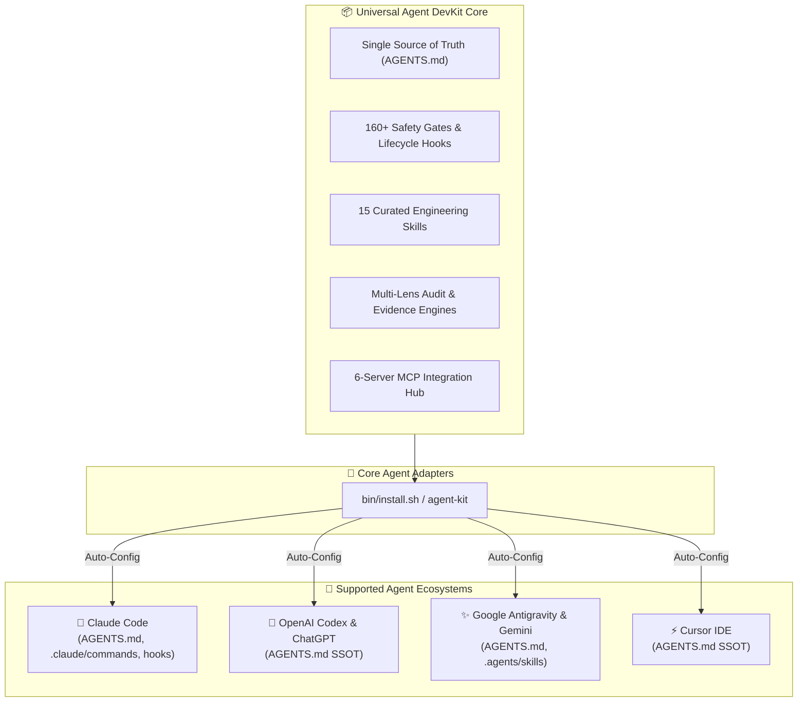

<div align="center">

# 🚀 Universal AI Agent DevKit & Quality Protocol
### *Framework chuẩn hóa toàn diện cung cấp Zero-Defect Protocol, 160+ Safety Gates, 48 Rule Chapters, 15 Curated Skills và Hệ sinh thái MCP cho mọi AI Coding Agent.*

[](https://github.com/ToanMobile/universal-agent-devkit)
[](https://opensource.org/licenses/MIT)
[-success.svg?style=for-the-badge)](./hooks/tests)
[](#-universal-multi-agent-matrix)
[-red.svg?style=for-the-badge)](#-quy-chuẩn-kỹ-thuật-tập-trung-single-source-of-truth)
[](#-15-curated-engineering-skills-catalog)
[](#-mcp-model-context-protocol-hub)

<p align="center">
  🌐 <b>Ngôn ngữ:</b> <a href="README.md"><b>English 🇺🇸</b></a> • <a href="README.vi.md"><b>Tiếng Việt 🇻🇳</b></a>
</p>

<p align="center">
  <b>One DevKit to rule them all:</b> Nâng tầm AI Coding Assistant từ mô hình đối thoại thông thường trở thành một <b>Senior Pair Programmer</b> kỷ luật, thực chứng và chuẩn mực.
</p>

[Cài Đặt Nhanh](#-quick-start--installation) • [Kiến Trúc](#-system-architecture) • [Ma Trận Đa Nền Tảng](#-universal-multi-agent-matrix) • [Quy Chuẩn Rulebook](#-quy-chuẩn-kỹ-thuật-tập-trung-single-source-of-truth) • [Danh Mục Skills](#-15-curated-engineering-skills-catalog) • [MCP Hub](#-mcp-model-context-protocol-hub) • [Kiểm Thử](#-verification--test-evidence)

---

</div>

## 📖 Tổng quan (Executive Summary)

**Universal Agent DevKit** là framework chuẩn hóa toàn diện dành cho 4 AI Coding Agent cốt lõi (**Claude Code**, **OpenAI Codex**, **Google Antigravity & Gemini**, **Cursor IDE**) và mọi mô hình nền tảng (**Claude 3.5/3.7 Sonnet**, **GPT-4o / o1 / o3**, **Gemini 2.0/3.0**, **DeepSeek R1/V3**).

DevKit cung cấp một hệ sinh thái khép kín:
1. **Quy chuẩn lập trình tối thượng:** Zero-Defect Protocol, Paired Executable Oracle, No-Fabrication Engine.
2. **Bộ Rulebook Độc Tôn (AGENTS.md / Agent.md):** Khử bỏ hoàn toàn tình trạng phân mảnh rulebook; hợp nhất 100% quy chuẩn kiến trúc, an ninh, kiểm thử và Pre-Code Gates vào một file quy chuẩn tối cao duy nhất.
3. **Tầng phòng thủ bằng máy (Machine Safety Gates):** 9+ lifecycle hooks và 160+ unit contract tests tự động bắt lỗi và chặn code ảo giác/phỏng đoán.
4. **Kho 15 Kỹ Năng Tinh Gọn (Curated Engineering Skills):** Phân thành 4 nhóm chuyên biệt bao quát trọn vẹn quy trình lập trình, kiểm thử và bàn giao.
5. **Hệ sinh thái MCP Hub:** Tích hợp sẵn 6 MCP servers mạnh mẽ nhất cho AST Knowledge Graph discovery, Tra cứu Docs thực tế, Điều khiển thiết bị qua ADB, và Play Console.

---

## 🌟 6 Trụ Cột Chất Lượng Cốt Lõi (Core Pillars)

```
┌────────────────────────────────────────────────────────────────────────────────────────┐
│                        UNIVERSAL AGENT QUALITY PROTOCOL                                │
├────────────────────────────┬────────────────────────────┬──────────────────────────────┤
│ 🛡️ Zero-Defect Protocol    │ 🚫 No-Fabrication Engine   │ 🔒 160+ Machine Safety Gates │
│ Paired Executable Oracle   │ Bảng quyết định C1-C9      │ Lifecycle Hooks chặn lỗi     │
│ (Bắt buộc RED → GREEN)     │ Không bịa số, dòng, metric │ Pre-Code & Stop Gates        │
├────────────────────────────┼────────────────────────────┼──────────────────────────────┤
│ ⚡ 7-Lens Multi-Audit      │ 📜 Unified Master Rules    │ 🧰 15 Curated Skills         │
│ Compile, Runtime, State,   │ AGENTS.md (Single SSOT)    │ 4 nhóm thực chiến: QA, TDD,  │
│ UX, Security, Architecture │ 0 File Rule Phân Mảnh      │ Spec Planning & Platform Dev │
└────────────────────────────┴────────────────────────────┴──────────────────────────────┘
```

<details>
<summary><b>🔍 Xem chi tiết 6 trụ cột chất lượng (Click để mở)</b></summary>

### 1. 🛡️ Zero-Defect Protocol & Paired Executable Oracle
- **Nguyên tắc bất khả xâm phạm:** Trước khi sửa bất kỳ dòng code production nào, Agent **bắt buộc phải thực thi một oracle kiểm thử** ở failure boundary thật và quan sát trạng thái thất bại (**RED**). Sau khi sửa code, thực thi lại đúng oracle đó và quan sát trạng thái thành công (**GREEN**).
- **Bảo vệ mã nguồn đang chạy đúng:** Mọi đoạn code hiện hữu mặc định được bảo vệ; cấm refactor tiện tay hoặc tự ý thay đổi contract không có bằng chứng lỗi.

### 2. 🚫 No-Fabrication Engine (Bảng Quyết Định C1–C9)
- **Triệt tiêu ảo giác:** Cấm tuyệt đối việc suy đoán file path, số dòng code, version thư viện, metric benchmark hoặc kết quả test.
- **Phân loại claim chặt chẽ:** C1 (Source Fact), C2 (Version/Docs), C3/C5 (Outcome/Fix Works), C4 (Scope Claim).

### 3. 🔒 160+ Automated Safety Gates (Lifecycle Hooks)
- **Kiểm soát tức thời:** PreToolUse và Stop hooks tự động đánh chặn mọi thao tác ghi file, gọi lệnh shell và bàn giao subagent.
- **Chặn đứng thao tác phá hủy:** Tự động chặn các lệnh git nguy hiểm (`git push --force`, `git reset --hard`), rò rỉ credentials và tuyên bố xong việc thiếu bằng chứng.

### 4. ⚡ 7-Lens Multi-Audit Engine
- **Audit toàn diện 7 góc nhìn:** Compile, Runtime, State Continuity, UX, Security, Performance, và Architecture.
- **Biên nhận thực thi đóng (Fail-Closed Receipts):** Bắt buộc có receipt hàm băm/chữ ký thực thi thật trước khi cho phép trạng thái PASS.

</details>

---

## 🏛️ System Architecture



---

## 📜 Quy Chuẩn Kỹ Thuật Tập Trung (Single Source of Truth)

Mọi quy chuẩn kỹ thuật, hợp đồng kiến trúc đa agent và quy trình chất lượng đều được tập trung vào duy nhất một Single Source of Truth: [`AGENTS.md`](file://AGENTS.md).

Không còn các thư mục rulebook phân mảnh gây xung đột hay phình to context. Các nội dung cốt lõi được bảo đảm trong `AGENTS.md`:
- **Kiến trúc & Modularization:** Phân tầng Clean Architecture, phân lập ranh giới module (Presentation → Domain → Data) và DI độc lập.
- **Pre-Code Gate (Mục 5):** 5 tiêu chí bắt buộc (Target + authority, đọc file thật, danh sách consumer, failure mechanism, residual) trước khi chạm vào mã nguồn.
- **Zero-Defect Protocol & Paired Executable Oracle:** Bắt buộc có kiểm thử RED → GREEN thật trên failure boundary, không có ngoại lệ (zero waivers).
- **No-Fabrication Engine (Bảng C1–C9):** Triệt tiêu ảo giác, cấm bịa đặt metric, dòng code hoặc kết quả kiểm thử.
- **Solo Dev & Quy Ước Git:** Chuẩn Conventional Commits (`feat`, `fix`, `chore`), cấm commit secrets, sửa mã nguồn phẫu thuật (surgical diffs).
- **Tương thích Đa Nền Tảng:** Tự động đồng bộ hóa sang toàn bộ 8 hệ sinh thái coding agent với độ tin cậy tuyệt đối.

---

## 🧰 15 Curated Engineering Skills Catalog

Kho 15 kỹ năng chuẩn hóa theo định dạng `SKILL.md` (YAML frontmatter + Progressive Disclosure), chia thành **4 nhóm chức năng thực chiến**:

### 1. 🧪 Testing & Zero-Defect QA (6 Skills)
| Skill | Slash Command | Chức Năng & Mục Đích Sử Dụng |
|---|---|---|
| **`qc`** | `/qc`, `/test`, `/qa` | Chạy kiểm thử tự động, lint check (ktlint), unit tests, Metalava API check, Translation gate và QA release gates. |
| **`fixbugs`** | `/fixbugs`, `/fix`, `/bugs` | Quy trình chẩn đoán và sửa lỗi tuân thủ nghiêm ngặt **Paired Executable Oracle (RED → GREEN)**. |
| **`tdd-workflow`** | `/tdd` | TDD Workflow: viết RED test kiểm chứng lỗi trước khi viết bất kỳ dòng code logic nào. |
| **`verification-before-completion`** | `/verify` | Verification gate cuối cùng trước khi tuyên bố hoàn thành task hoặc tạo PR. |
| **`triage-crashlytics-bug`** | `/crashlytics` | Phân tích Crashlytics stack trace, native crash, OOM leak và đề xuất phương án xử lý gốc rễ. |
| **`deploy`** | `/deploy`, `/build` | Quy trình đóng gói APK/AAB, kiểm tra signing, ProGuard/R8 mappings và release readiness. |

---

### 2. 🔍 Code Review & Visual QA (3 Skills)
| Skill | Slash Command | Chức Năng & Mục Đích Sử Dụng |
|---|---|---|
| **`qa-review`** | `/qa-review`, `/review` | Chất vấn và audit code diff trước PR, sinh acceptance criteria và ma trận kịch bản test (Vai trò × Dữ liệu × Luồng lỗi). |
| **`open-code-review`** | `/ocr`, `/open-code-review` | Tích hợp engine Alibaba OpenCodeReview: giải quyết triệt để lệch dòng (resolver.go), gom nhóm file thông minh, audit diff tự động không ồn. |
| **`qa-visual`** | `/qa-visual`, `/visual` | Tự động chụp màn hình và audit lỗi bố cục layout DOM (tràn khung, lệch align, chồng lấp) kèm upload cloud. |

---

### 3. 📐 Kiến Trúc, Git & Lập Kế Hoạch (4 Skills)
| Skill | Slash Command | Chức Năng & Mục Đích Sử Dụng |
|---|---|---|
| **`spec-driven-development`** | `/plan` | Lập kế hoạch theo mô hình Spec-Kit Lite cho mọi thay đổi chạm ≥3 files hoặc ≥2 modules. |
| **`merge-conflict-resolver`** | `/conflict` | Giải quyết Git merge / rebase / stash conflict an toàn dựa trên phân tích ngữ nghĩa 3-way merge. |
| **`session-handoff`** | `/handoff` | Đóng gói toàn bộ ngữ cảnh, công việc dở dang và bằng chứng để chuyển giao sang session mới. |
| **`security-checklist`** | `/scan` | Audit an ninh: Intent filter, URI traversal, Storage Access Framework, exported components, permissions. |

---

### 4. 🛠️ Công Cụ Codebase & Nền Tảng (3 Skills)
| Skill | Slash Command | Chức Năng & Mục Đích Sử Dụng |
|---|---|---|
| **`graph-navigation`** | `/graph` | Khám phá codebase, trace call/data flow, phân tích blast radius bằng AST Knowledge Graph. |
| **`codebase-memory`** | `/codebase-memory` | Quản trị và đồng bộ AST Knowledge Graph Database cho dự án lớn. |
| **`android-cli`** | `/android-cli` | Quản lý Android SDK, điều khiển emulator/AVD và chụp UI screenshot từ CLI. |

---

## 🌐 Universal Multi-Agent Matrix

DevKit tự động đồng bộ cấu hình tương thích cho 4 hệ sinh thái agent cốt lõi với `AGENTS.md` làm Single Source of Truth:

| Nền tảng / IDE | Cấu Hình & Tích Hợp | Tính Năng Được Kích Hoạt | Trạng Thái |
|---|---|---|:---:|
| **Claude Code** | `AGENTS.md`, `.claude/settings.json`, `.claude/commands/`, `.claude/hooks/`, `.mcp.json` | Slash Commands (`/qc`, `/fix`, `/plan`), Safety Hooks chặn lỗi runtime, Subagents, MCP Tools | `READY` 🟢 |
| **OpenAI Codex** | `AGENTS.md` (SSOT) | Universal Master Rules, Pre-Code Gate & Zero-Defect protocol cho GPT models & Canvas | `READY` 🟢 |
| **Antigravity / Gemini** | `AGENTS.md`, `.agents/skills/`, `mcp_config.json` | Auto-discovery Skills, QA Protocols, Tích hợp MCP Hub | `READY` 🟢 |
| **Cursor IDE** | `AGENTS.md` (SSOT) | Quy chuẩn repo gốc, Zero-Defect & Pre-Code Gate enforcement | `READY` 🟢 |

---

## 🔌 MCP (Model Context Protocol) Hub

Hệ sinh thái MCP được tích hợp sẵn sàng trong thư mục `mcp/` với hơn 100+ JSON tool schemas:

```
universal-agent-devkit/mcp/
├── .mcp.json               # Cấu hình chuẩn cho Claude Code & Cursor
├── mcp_config.json         # Cấu hình chuẩn cho Antigravity & Gemini
├── README.md               # Hướng dẫn chi tiết thiết lập biến môi trường
└── schemas/                # 100+ Tool Definitions & Schemas
    ├── codebase-memory-mcp/
    ├── context7/
    ├── android-code-search/
    ├── android-skills/
    ├── replicant-mcp/
    └── play-store/
```

| Server Name | Transport | Khả năng & Công cụ nổi bật |
|---|---|---|
| **`codebase-memory-mcp`** | stdio | Knowledge Graph AST, tìm kiếm symbol, truy vết call path (`search_graph`, `trace_path`, `get_code_snippet`). |
| **`context7`** | npx | Tra cứu tài liệu chính thức của thư viện theo version thực tế (`resolve-library-id`, `query-docs`). |
| **`android-code-search`** | npx | Tìm kiếm mã nguồn và symbol trong toàn bộ Android Open Source Project (`search_android_code`). |
| **`android-skills`** | npx | Tra cứu kỹ năng phát triển Android chính thức (`list_skills`, `get_skill`). |
| **`replicant-mcp`** | npx | Điều khiển ADB, capture màn hình, query UI node, click/swipe UI, đọc logcat, chạy Gradle. |
| **`play-store`** | Python stdio | Triển khai APK/AAB, track crash rate, ANR rate, review response, vitals summary. |

---

## 🚀 Quick Start & Installation

### Option 1: Cài đặt từ xa 1 dòng lệnh (Remote 1-Liner — Không cần clone trước)

```bash
# Chế độ tương tác (Khuyến nghị — Cho phép chọn Agent bạn muốn cài):
/bin/bash -c "$(curl -fsSL https://raw.githubusercontent.com/ToanMobile/universal-agent-devkit/main/bin/quick-install.sh)"

# Chế độ tự động nhanh (Cài đặt trọn bộ tất cả Agents):
curl -fsSL https://raw.githubusercontent.com/ToanMobile/universal-agent-devkit/main/bin/quick-install.sh | bash
```

---

### Option 2: Clone về máy và cài đặt CLI toàn cục (Khuyến nghị)
```bash
# 1. Clone repository
git clone https://github.com/ToanMobile/universal-agent-devkit.git
cd universal-agent-devkit

# 2. Cài đặt agent-kit vào ~/.local/bin
make install

# 3. Kích hoạt tức thì cho BẤT KỲ dự án nào trên máy tính
cd /path/to/your-project
agent-kit init
```

#### Tùy chọn ngôn ngữ:
- **Mặc định (Tiếng Anh):** `agent-kit init`
- **Tiếng Việt:** `agent-kit init --lang=vi`

---

### Option 3: Cài đặt dạng Claude Code Plugin
```bash
claude plugin install github.com/ToanMobile/universal-agent-devkit
# hoặc từ thư mục local:
claude plugin install /path/to/universal-agent-devkit
```

---

## 🧪 Verification & DevKit CLI (`agent-kit`)

DevKit đi kèm công cụ dòng lệnh quản trị và kiểm thử chuyên dụng:

```bash
# 1. Khởi tạo dự án (Tự động nhận diện domain & agents):
agent-kit init

# 2. Chạy trọn bộ 294+ Regression Test Suite:
agent-kit test

# 3. Liệt kê toàn bộ Skills:
agent-kit list

# 4. Liệt kê toàn bộ Slash Commands:
agent-kit commands

# 5. Đồng bộ hóa Skills & Slash Commands:
agent-kit sync
```

### 📊 Báo Cáo Kiểm Thử (Test Evidence):
- **Hook Contract Tests:** `160 / 160 PASS (100%)` ✅
- **Workflow Engine Tests:** `134 / 134 PASS (100%)` ✅
- **Multi-Agent Sandbox Matrix:** `4 / 4 Nền Tảng Cốt Lõi Verified` ✅

---

## 📁 Cấu Trúc Thư Mục Chuẩn (Project Layout)

```
universal-agent-devkit/
├── .claude-plugin/              # Claude Code Plugin Manifest (plugin.json)
├── bin/                         # CLI entrypoints (install.sh, agent-kit, quick-install.sh)
├── AGENTS.md                    # Universal Master Rules & SSOT (File Rule Duy Nhất)
├── skills/                      # 15 Curated Engineering Skills (SKILL.md standard)
├── commands/                    # Auto-discovered Slash Commands & Aliases (30 commands)
├── agents/                      # Specialized Subagents (.md)
├── hooks/                       # 9+ Lifecycle Safety Gates & 160+ Contract Tests
├── workflows/                   # Audit & Test Engines (134+ JS/MJS Tests)
├── mcp/                         # MCP Hub (.mcp.json, mcp_config.json, schemas)
├── setup.sh                     # Root setup entrypoint
├── Makefile                     # Build & Global install automation
└── adapters/                    # Setup scripts cho 4 nền tảng Agent & IDE cốt lõi
```

---

## 📄 License & Repository

- **GitHub:** [https://github.com/ToanMobile/universal-agent-devkit](https://github.com/ToanMobile/universal-agent-devkit)
- **License:** Distributed under the **MIT License**.

<div align="center">
  <sub>Built with precision by Senior AI Software Engineers. Powered by Universal Agent Architecture.</sub>
</div>
